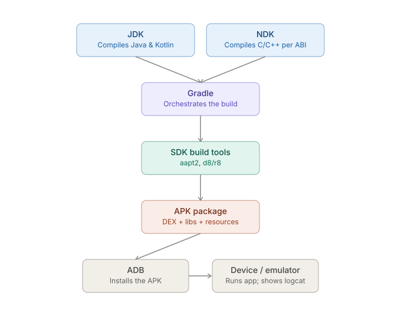

# React Native CLI — Native Toolchains: Android — Core pieces and how they fit together

_Last updated: 2026-08-07_

## Overview

The Android native toolchain underneath a React Native CLI project is made up of five distinct pieces — JDK, Android SDK, Android NDK, Gradle, and ADB. RN CLI wraps them, but understanding what each one actually does is what turns a cryptic build failure into a fixable one.

## The pieces

- **JDK** — compiles the Java/Kotlin layer. Version mismatches with Gradle/RN are a common source of build breakage (e.g. Gradle 8.x expecting JDK 17, an older RN template assuming JDK 11).
- **Android SDK** — not one thing, but a set of components managed by `sdkmanager`/Android Studio's SDK Manager: platform tools (`adb`, `fastboot`), build tools (`aapt2`, `zipalign`, `apksigner`), and platform APIs versioned by API level (`compileSdkVersion`, `targetSdkVersion`, `minSdkVersion`).
- **Android NDK** — needed because RN native modules (and Hermes/JSI) compile C/C++ for each CPU architecture (`arm64-v8a`, `armeabi-v7a`, `x86`, `x86_64`). Invisible day-to-day unless you touch native modules directly — Gradle invokes it via CMake.
- **Gradle** — orchestrates the whole build: resolves dependencies (including autolinked RN native modules), invokes the JDK for Java/Kotlin, invokes the NDK/CMake for native code, packages the output with the SDK's build tools, and signs it. Source of most Android build pain, since it's the hub that touches everything else.
- **ADB (Android Debug Bridge)** — not part of the build itself; it's how you talk to a running device/emulator afterward: installing the APK, streaming `logcat`, port-forwarding for Metro.

## How they fit together — a build pipeline

Gradle is the hub — it's the only piece that talks to all the others. The JDK and NDK are just compilers it shells out to; the SDK's build tools handle packaging/signing (`aapt2` for resources, `d8`/`r8` for dexing/shrinking); ADB only enters once there's an artifact to install.

## Why this matters day to day

- A build failure that looks like an RN CLI error is almost always Gradle failing one step above — and the real error is often a JDK version mismatch, an NDK/ABI issue, or a resource conflict from `aapt2`.
- `npx react-native run-android` is just: Gradle build → install via ADB → launch. Nothing magic.
- If you never write native code, the NDK is invisible — Hermes/JSI compilation happens for you. It becomes visible the moment you add a native module with its own `.cpp`, or a build breaks on an unfamiliar ABI.

## Key Takeaways

- Gradle is the orchestrator that calls the JDK, NDK, and SDK build tools — not a peer to them.
- JDK/Gradle version mismatches and NDK/ABI issues are the most common causes of "RN CLI build failed" errors that are really one layer deeper.
- ADB is purely post-build: install + debug, not part of compiling/packaging.

## Open Questions / Follow-ups

- JDK/Gradle version compatibility in more detail.
- How RN autolinking wires native modules into this pipeline (`settings.gradle`, `app/build.gradle`).
- ABI splitting vs universal APK tradeoff (already flagged in this folder's `Topics.md`).
