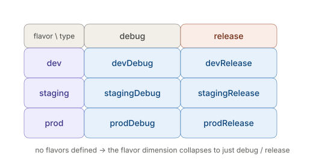

# React Native CLI — Native Toolchains: Android — Gradle specifics

_Last updated: 2026-08-07_

## Overview

A deeper look at the Gradle layer flagged in this folder's `Topics.md` — the file hierarchy, how build variants are actually constructed, what `gradle.properties` controls, and the mechanics of how autolinking and dependency resolution wire native modules in.

## The Gradle file hierarchy

Gradle in an RN Android project has three levels, each with a different scope:

```
android/
├── settings.gradle          <- declares which modules exist (":app", plus autolinked native modules)
├── build.gradle              <- PROJECT-level: repos, classpath (Android Gradle Plugin version, Kotlin version)
└── app/
    └── build.gradle           <- MODULE-level: the actual app config (applicationId, SDK versions, signing, variants, dependencies)
```

- **`settings.gradle`** is where autolinking actually injects itself — every native module you `npm install` gets an `include ':react-native-something'` line added here (usually via the RN Gradle plugin reading `package.json`, not hand-written anymore in modern RN).
- **Project-level `build.gradle`** rarely changes by hand except bumping the Android Gradle Plugin (AGP) version or adding a new repository (e.g. a private Maven repo for a paid SDK).
- **`app/build.gradle`** is where almost all day-to-day editing happens — `compileSdkVersion`, `defaultConfig`, `buildTypes`, `productFlavors`, `dependencies {}`.

## Build variants: buildTypes × productFlavors

A **variant** is the cross product of a **build type** and a **product flavor**:



If you never define `productFlavors`, you just get `debug`/`release` — the flavor dimension collapses away. Flavors are how you get separate `applicationId`s, API base URLs, or app icons per environment (dev/staging/prod) without maintaining three separate projects — each flavor can override `resValue`, `buildConfigField`, or point at a different `google-services.json`.

You build a specific variant with:
```
./gradlew assembleProdRelease
./gradlew installDevDebug
```

## gradle.properties flags

This file holds project-wide switches read by both Gradle and the RN Gradle plugin:

- `newArchEnabled=true/false` — Fabric + TurboModules toggle
- `hermesEnabled=true/false` — JS engine choice
- `android.useAndroidX=true` — required for any modern RN project
- JVM args (`org.gradle.jvmargs=-Xmx4096m`) — bump this when Gradle daemons OOM on big projects

It's a flat key=value file, not Groovy/Kotlin DSL — which is why RN's own build scripts can read it directly (`project.properties['newArchEnabled']` inside `build.gradle`).

## Dependency resolution & autolinking, mechanically

When you `npm install react-native-something`:

1. The RN Gradle plugin scans `node_modules` for packages with a `react-native.config.js`/native `android/` folder.
2. It auto-generates the `include` statements in `settings.gradle` and adds `implementation project(':react-native-something')` to `app/build.gradle`'s dependency block — you never touch these by hand in modern RN (0.60+).
3. Actual version resolution (which version of a *shared* native dependency wins, e.g. two libraries both pulling in different AndroidX versions) still goes through normal Gradle conflict resolution — highest version wins by default. This is where "duplicate class" or manifest merger errors come from, when two libraries disagree hard enough that highest-wins isn't enough to reconcile them.

## Where this bites you

- Adding a flavor *after* release signing is already configured means a signing config is needed *per flavor* too, or that flavor will silently build unsigned/debug-signed.
- Flags like `newArchEnabled` can silently no-op if a library in `node_modules` doesn't support the New Architecture yet — no build error, just runtime crashes.
- Flavor-specific `google-services.json`/config files live in `app/src/<flavorName>/` — easy to forget when adding a new flavor, since the default `app/src/main/` one won't apply.

## Key Takeaways

- A variant is always flavor × buildType — with no flavors defined, it collapses to just `debug`/`release`.
- `settings.gradle` and `app/build.gradle`'s dependency block are where autolinking writes generated entries — not meant to be hand-edited in modern RN.
- Gradle's dependency conflict resolution defaults to highest-version-wins, which is the root cause behind most "duplicate class"/manifest merger errors from clashing transitive native dependencies.
- `gradle.properties` flags can fail silently (no build error) if a dependency doesn't actually support what the flag is asking for.

## Open Questions / Follow-ups

- How signing configs interact with flavors in more detail (per-flavor `signingConfig` blocks).
- The exact mechanics of Gradle's dependency conflict resolution (resolution strategies, forcing a version, excluding a transitive dependency).
- NDK/CMake native-module build path (ties into llama.rn work) — still open from the parent Android doc.
- Signing/release build process end-to-end — still open from the parent Android doc.
- iOS native toolchain as its own future subtopic file — still open from the parent Android doc.
