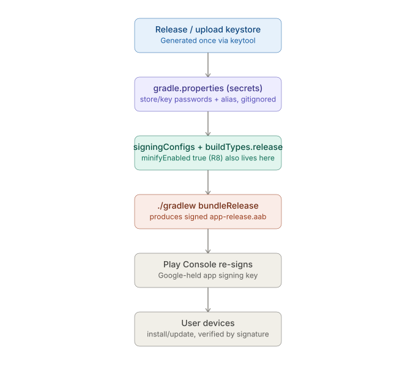

# React Native CLI — Native Toolchains: Android — Signing and Release Builds

_Last updated: 2026-08-08_

## Overview

Deep dive on the Android signing and release process end-to-end — from generating a release keystore through Play Console distribution — following up on the brief mention in [02. Gradle specifics.md](02.%20Gradle%20specifics.md).

## Why signing exists

Every APK/AAB must be cryptographically signed before it can be installed or accepted by the Play Store. The signature is how Android proves "this update came from the same author as what's already installed" — an update is rejected outright if the signature doesn't match. This is why debug and release use separate keystores: a debug key should never carry a release identity.

## Debug vs release keystores

- **Debug keystore** — auto-generated by the Android SDK on first build (`~/.android/debug.keystore`), same password (`android`/`android`) everywhere. Local development only.
- **Release keystore** — generated once, by hand, and becomes the app's permanent identity:

```bash
keytool -genkeypair -v -keystore my-release-key.keystore \
  -alias my-key-alias -keyalg RSA -keysize 2048 -validity 10000
```

`-validity 10000` is in days (~27 years) — deliberately long, because the keystore is effectively permanent. Losing it means you can't publish updates to an app already live under that identity; you'd have to ship as a new app with a new package name. Highest-stakes file in the Android toolchain — back it up outside the laptop (password manager vault), never commit it to version control.

## Wiring it into Gradle



In `android/app/build.gradle`:

```gradle
android {
    ...
    signingConfigs {
        release {
            storeFile file(MYAPP_RELEASE_STORE_FILE)
            storePassword MYAPP_RELEASE_STORE_PASSWORD
            keyAlias MYAPP_RELEASE_KEY_ALIAS
            keyPassword MYAPP_RELEASE_KEY_PASSWORD
        }
    }
    buildTypes {
        release {
            signingConfig signingConfigs.release
            minifyEnabled true       // enables ProGuard/R8
            shrinkResources true
        }
    }
}
```

The `MYAPP_RELEASE_*` values come from `android/gradle.properties` (or a separate untracked file), never hardcoded:

```properties
MYAPP_RELEASE_STORE_FILE=my-release-key.keystore
MYAPP_RELEASE_STORE_PASSWORD=xxxxx
MYAPP_RELEASE_KEY_ALIAS=my-key-alias
MYAPP_RELEASE_KEY_PASSWORD=xxxxx
```

That properties file must be gitignored; the keystore file itself lives outside version control too, injected separately in CI.

## Play App Signing (the modern model)

Since 2021, new Play Store apps use Play App Signing, which splits the single "one keystore is your whole identity" model into two keys:

- **Upload key** — the keystore you generate and use in `signingConfigs`, same as above. Signs the AAB you upload to Play Console.
- **App signing key** — held by Google. Play Console verifies your upload, strips your signature, and re-signs with this key before the app reaches devices.

Upside: if the *upload* key is lost, Google support can help reset it — no longer catastrophic the way losing the single pre-2021 keystore was. This safety net only applies if the app was first published under Play App Signing (default for new apps, or opted in for older ones).

## APK vs AAB

- **APK** — `./gradlew assembleRelease`. Traditional installable package; used for sideloading and internal testing.
- **AAB (Android App Bundle)** — `./gradlew bundleRelease`. Required by Play Store for new submissions since 2021. Play generates optimized, device-specific APKs from it at install time — this is what automatically handles the ABI-splitting that [Gradle specifics](02.%20Gradle%20specifics.md) covers as a manual `splits { abi {...} }` config for non-Play distribution.

## versionCode and versionName

In `android/app/build.gradle`, under `defaultConfig`:

```gradle
defaultConfig {
    versionCode 12        // integer, MUST increase on every Play Store submission
    versionName "1.4.0"   // human-readable, shown to users
}
```

`versionCode` is what Play Store tracks to determine "is this newer than what's live." Forgetting to bump it is a common release-day failure — the upload gets rejected.

## Where ProGuard/R8 fits in

`minifyEnabled true` in `buildTypes.release` turns on R8, which shrinks and obfuscates code. The release build is therefore not just "the same code plus a signature" — it's a materially different artifact. This is also why native-module crashes that only appear in release builds are often a missing R8 `-keep` rule stripping code that reflection/JNI depends on (see [02. Gradle specifics.md](02.%20Gradle%20specifics.md) for the ProGuard/R8 note).

## Key Takeaways

- The release keystore is a permanent identity — generate it once, back it up durably, never commit it.
- Signing config values (`storePassword`, `keyPassword`, etc.) live in a gitignored `gradle.properties`, referenced from `signingConfigs` in `build.gradle`.
- Play App Signing (default since 2021) splits identity into an upload key (yours) and an app signing key (Google's) — losing the upload key is now recoverable.
- AAB is the required Play Store format and handles per-ABI splitting automatically; APK remains useful for sideloading/internal builds.
- `versionCode` must increase on every submission — a common, easy-to-forget release blocker.

## Open Questions / Follow-ups

- How CI systems (Fastlane, Bitrise, GitHub Actions) inject the keystore and secrets securely without committing them.
- How this flow differs for internal/CI builds that skip Play Store distribution entirely.
