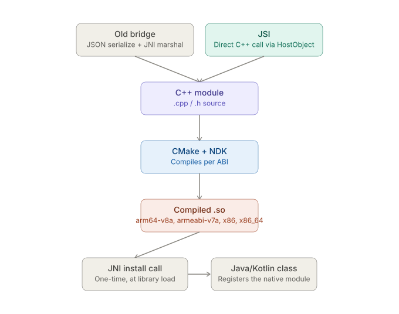

# React Native CLI — Native Toolchains: Android — Native Module and JSI Build Path

_Last updated: 2026-08-11_

## Overview

Follows up on the open question in [01. Core pieces and how they fit together.md](01.%20Core%20pieces%20and%20how%20they%20fit%20together.md) about the NDK/CMake native-module build path. Covers how a native module's C/C++ actually gets compiled into the app, and clarifies that JSI changes the *runtime calling convention* into that native code, not the build system that produces it — relevant background for llama.rn-style modules.

## Where the C++ lives and how Gradle finds it

A native module's Android side typically looks like:

```
android/
  src/main/
    jni/  (or cpp/)
      CMakeLists.txt
      my-native-lib.cpp
      my-native-lib.h
  build.gradle
```

Two build systems can drive the native side: **`ndk-build`** (legacy, `Android.mk` + `Application.mk`) or **CMake** (modern default, used by RN's own core and most current libraries). Gradle wires whichever one is used via `externalNativeBuild` in the module's `build.gradle`:

```gradle
android {
  externalNativeBuild {
    cmake {
      path "src/main/jni/CMakeLists.txt"
    }
  }
}
```

A Gradle build shells out to CMake as a nested build graph: CMake generates per-ABI build directories, and each one invokes the NDK's toolchain (clang) to compile the `.cpp` into a `.so`.

## Per-ABI compilation — why it multiplies

This connects directly to the ABI splits covered in [02. Gradle specifics.md](02.%20Gradle%20specifics.md). The NDK doesn't produce one binary — it compiles once *per target ABI* (`arm64-v8a`, `armeabi-v7a`, `x86`, `x86_64`), since these are different instruction sets, not just packaging variants. CMake reads `ndk.abiFilters` / `externalNativeBuild.cmake.abiFilters` to know which ones to build.

For something like llama.cpp, this matters more than for a typical native module:

- It wants **NEON** SIMD instructions on `arm64-v8a`/`armeabi-v7a` for performance, so `CMakeLists.txt` often has ABI-conditional compiler flags rather than compiling identical source everywhere.
- The resulting `.so` per ABI can be several MB, so bundling all four into one universal APK gets expensive fast — the ABI-split-vs-universal-APK tradeoff from Gradle specifics matters even more here.

## JSI's role — and what it doesn't change



It's easy to assume "JSI build path" is a build-system concept, but JSI is actually a **runtime calling-convention** change:

- **Old bridge** — JS calls a native method → arguments serialize to JSON → sent across the bridge → deserialized natively → JNI marshals Java↔native types. Async, batched, has real overhead.
- **JSI** — the JS engine (Hermes) holds a direct C++ reference to a `HostObject`/`HostFunction`. Calling a native method from JS becomes a direct C++ function call — no JSON, no bridge queue, no per-call JNI marshaling.

**JSI doesn't change how the `.so` gets built.** It's still compiled through the exact same CMake/NDK/Gradle pipeline above. What JSI changes is what happens *after* the library loads: instead of registering JNI native methods for the bridge to call, the module registers a JSI binding — usually via a small C++ "install" function invoked from Java through one JNI call at startup — that hands the JS runtime direct C++ pointers. The compiled artifact and the per-ABI story are identical either way; JSI only removes overhead from the *call*, not the *build*.

## Where this breaks in practice

Failure modes here are distinct from typical Gradle errors:

- **`UnsatisfiedLinkError: dlopen failed`** at runtime — the `.so` for the device's actual ABI was never built, usually because the app-level `abiFilters` in `build.gradle` don't match what the library's own CMake build was told to produce.
- **CMake configuration errors** — usually an NDK version mismatch between what `gradle.properties`/`local.properties` specifies and what the module's `CMakeLists.txt` expects (`cmake_minimum_required`, `ANDROID_STL`).
- **Missing symbols at link time** — a C++ ABI/STL mismatch, e.g. one library built against `c++_shared` and another against `c++_static`. Risk goes up with every additional native module with its own C++ dependencies stacked in the same app (a real risk alongside something like llama.rn).

## Key Takeaways

- Native modules with real C/C++ compile through CMake or `ndk-build`, wired into Gradle via `externalNativeBuild` — a nested build graph inside the Gradle build.
- Compilation happens once per target ABI; this is the same ABI-splits concern from Gradle specifics, but with higher stakes for large native payloads like llama.cpp.
- JSI is a calling-convention change (direct C++ call vs. bridge + JNI marshaling), not a build-system change — the `.so` build path is identical whether a module uses JSI or the old bridge.
- `UnsatisfiedLinkError`, CMake config mismatches, and C++ STL/ABI conflicts are the characteristic failure modes at this layer, distinct from ordinary Gradle build errors.

## Open Questions / Follow-ups

- Walk through an actual `CMakeLists.txt` for a llama.cpp-style module in detail.
- The JNI "install" call in detail — what the C++ registration function actually looks like.
- Step-by-step debugging process for an `UnsatisfiedLinkError`.
