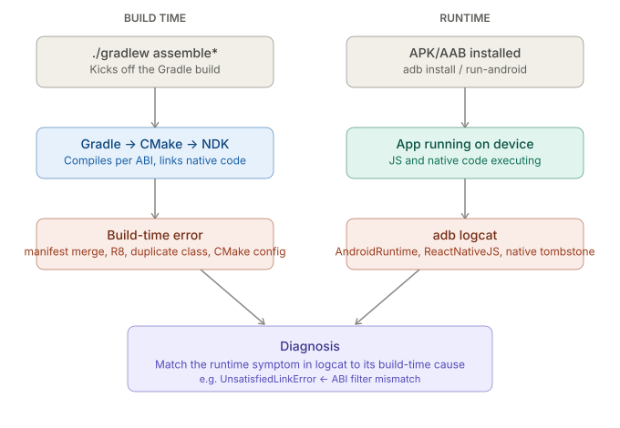

# React Native CLI — Native Toolchains: Android — Debugging Tools

_Last updated: 2026-08-11_

## Overview

Covers the Android-specific toolkit for diagnosing failures beneath the JS layer — where a build actually failed underneath RN CLI's truncated error output, and where runtime crashes in native code surface once the app is running. Follows up directly on the failure modes flagged in [04. Native module and JSI build path.md](04.%20Native%20module%20and%20JSI%20build%20path.md).

## Two failure domains: build-time vs runtime



Android debugging splits into two very different domains, and mixing them up wastes time:

- **Build-time failures** — Gradle/CMake/NDK never produced a working artifact. Nothing runs.
- **Runtime failures** — the artifact built fine, but crashes or misbehaves once installed and running on a device/emulator.

The [signing doc](<03. Signing and release builds.md>)'s note that R8 can silently strip code a native module needs via reflection/JNI is a good example of how these domains interact: the failure *shows up* at runtime (a crash in logcat), but its root cause is a build-time config gap (a missing `-keep` rule). Same story for the JSI doc's `UnsatisfiedLinkError` — runtime symptom, build-time cause (an ABI filter mismatch).

## Build-time: getting past RN CLI's truncated errors

`npx react-native run-android` is a thin wrapper around Gradle. When a build fails, RN CLI often prints only the last few lines of Gradle's output — enough to know *something* failed, rarely enough to know *why*. The fix is to drop straight to raw Gradle:

```bash
./gradlew assembleDebug --stacktrace   # full Java stack trace for the failure
./gradlew assembleDebug -i             # --info: verbose task-by-task log
./gradlew assembleDebug -d             # --debug: everything, including plugin internals
```

Escalation order matters — `--stacktrace` first (usually enough to see *which* task and *what exception*), `-i` if you need to see what Gradle was actually doing leading up to it, `-d` only as a last resort since it's extremely noisy.

Android Studio's **Build tool window** shows the same underlying Gradle output but with clickable file/line jumps and a collapsed/expandable task tree — often faster than reading raw CLI output once you know roughly where the problem is, but the CLI flags are what you reach for over SSH/CI or when Android Studio itself won't sync.

## Runtime: adb logcat

Once the app is running, `adb logcat` is where native crashes, JNI errors, and anything below the JS layer surface — Metro's red-box only covers JS exceptions, not native ones.

```bash
adb logcat *:E                                        # errors only, all tags — noisy but a good first pass
adb logcat --pid=$(adb shell pidof -s com.yourapp)    # scope to just your running app
adb logcat -s ReactNativeJS:V AndroidRuntime:E        # filter to specific tags
```

Two tags worth knowing by name:

- **`AndroidRuntime`** — uncaught Java/Kotlin exceptions, the closest thing to a native "red box."
- **`ReactNativeJS`** — `console.log`/JS-side output forwarded to logcat, useful when Metro's own terminal isn't visible (e.g. debugging a release build with no dev server attached).

For a real native crash (a segfault in C++, not a Java exception), logcat shows a **tombstone** — a structured native stack trace with a `Fatal signal` line and a backtrace of raw addresses. Those addresses are meaningless until symbolicated against the `.so` file's debug symbols for the matching ABI — the direct runtime counterpart to the per-ABI compilation covered in the [JSI build-path doc](<04. Native module and JSI build path.md>): a tombstone from an `arm64-v8a` device needs the `arm64-v8a` build's symbols, not any other ABI's.

## Connecting the two: diagnosing an UnsatisfiedLinkError

Given a real `UnsatisfiedLinkError` (from the JSI doc's "where this breaks" list), the actual debugging path threads both domains:

1. `adb logcat` → confirms it's `UnsatisfiedLinkError: dlopen failed` and shows which library name failed to load.
2. Check the device's actual ABI: `adb shell getprop ro.product.cpu.abi`.
3. Check the APK's `abiFilters` in `build.gradle` against that ABI — this is a build-time config problem, so `./gradlew assembleDebug -i` confirms which ABIs actually got built and packaged.

The general pattern: **logcat tells you *what* broke at runtime; `--stacktrace`/`-i`/`-d` tell you *why* it was built wrong in the first place.**

## Key Takeaways

- Android debugging splits into build-time (Gradle/CMake/NDK never produced an artifact) and runtime (the artifact crashes once running) — treating them as one search wastes time.
- RN CLI's own error output is frequently truncated; `--stacktrace`, `-i`, and `-d` on raw `./gradlew` are the escalation path to the real Gradle error.
- `adb logcat` is where native crashes and JNI errors surface — `AndroidRuntime` for uncaught exceptions, `ReactNativeJS` for forwarded JS console output.
- Native crash tombstones need symbolicating against the `.so` for the matching ABI — the runtime counterpart to per-ABI compilation.
- Diagnosing native-module runtime errors (e.g. `UnsatisfiedLinkError`) means matching a logcat symptom to a build-time cause (ABI filters, R8 `-keep` rules, CMake/NDK version mismatches).

## Open Questions / Follow-ups

- Symbolicating a native tombstone step by step (tooling: `ndk-stack`, Android Studio's built-in symbolication).
- ANR (Application Not Responding) debugging specifically.
- Flipper / React Native DevTools comparison — belongs to the broader "Debugging & Performance" roadmap topic, not this Android-specific one.
