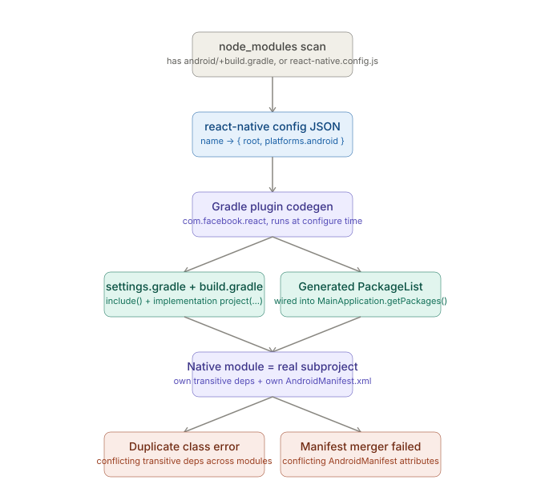

# React Native CLI — Native Toolchains: Android — Where RN CLI Abstracts This Away

_Last updated: 2026-08-11_

## Overview

Follows up on the open item in [Topics.md](Topics.md) about where `npx react-native run-android` and autolinking hide real complexity. Covers what the `run-android` wrapper actually does versus raw Gradle, how autolinking wires a native module into the build fresh on every run, and the two failure modes — duplicate class errors and manifest merger failures — that surface when that abstraction leaks.

## The `run-android` wrapper layer

Two layers of abstraction stack on top of raw Gradle:

- **`react-native-cli` (JS layer)** — resolves the device/emulator target, then shells out to Gradle (`./gradlew installDebug -PreactNativeArchitectures=...`). This is the thin wrapper already covered in the [debugging tools doc](05.%20Debugging%20tools.md) — when its output is truncated, dropping to raw `./gradlew` with `--stacktrace`/`-i`/`-d` is the fix.
- **`apply plugin: "com.facebook.react"` (in `android/app/build.gradle`)** — this is where autolinking actually happens, at Gradle *configure* time, before any compilation starts. This is the layer this doc digs into.

## How autolinking wires a native module in



Before RN 0.60, `react-native link` rewrote native files by hand, once, statically. Since 0.60, linking is re-derived **fresh on every build**:

1. **`node_modules` scan** — the CLI walks `node_modules` looking for packages that either have an `android/` folder with a `build.gradle`, or declare themselves via `react-native.config.js`.
2. **`react-native config` JSON** — produces a dependency graph (`{ "react-native-vector-icons": { root, platforms: { android: {...} } }, ... }`). Runnable directly for debugging: `npx react-native config`.
3. **Gradle plugin codegen** — the `com.facebook.react` plugin consumes that JSON at configure time and produces two things:
   - `settings.gradle` gets `include(":react-native-vector-icons")` plus a project-dir mapping, and `app/build.gradle` gets `implementation project(":react-native-vector-icons")` — both generated dynamically, not hand-written.
   - A generated `PackageList` is wired into `MainApplication`'s `getPackages()`, so a new native module never requires hand-editing `MainApplication.java`/`.kt`.
4. **Result** — every native module becomes a real Gradle subproject, with its own transitive dependencies and its own `AndroidManifest.xml`.

The mental model that matters: **autolinking isn't a one-time file edit, it's a Gradle plugin step that re-derives everything from `node_modules` on every single build.** That's why deleting `node_modules` and reinstalling can "fix" a linking issue — the JSON graph gets rebuilt from scratch.

### The escape hatch: `react-native.config.js`

When autolinking guesses wrong, `react-native.config.js` can exclude a package or override its native source dir:

```js
module.exports = {
  dependencies: {
    'some-broken-native-lib': {
      platforms: { android: null }, // opt this package out of Android autolinking
    },
  },
};
```

## Where it breaks

**Duplicate class errors** — because autolinking turns every native module into a real Gradle subproject with its own transitive dependencies, two modules can easily pull in two different versions of the same underlying library (a support library, OkHttp, Kotlin stdlib). Gradle finds the same class defined twice on the classpath and refuses to proceed. This is a dependency-resolution problem that autolinking multiplies rather than causes directly — more subprojects means more dependency trees being merged. Typical fix: `exclude group:` on the offending transitive dependency, or forcing a version via `resolutionStrategy`.

**Manifest merger failed** — every native module can ship its own `AndroidManifest.xml` (permissions, exported activities, SDK constraints). Gradle's manifest merger combines the app's manifest with *all* of them at build time. If two manifests declare the same attribute differently, the merge can't resolve it automatically and fails, often pointing at a component the app itself never touched — because it came from a transitive native module's manifest. Fix: a `tools:replace` or `tools:node="merge"` directive in the app's own manifest to explicitly state which value wins.

Both failures surface as build-time Gradle errors, so the same escalation path from the [debugging tools doc](05.%20Debugging%20tools.md) applies — `--stacktrace`/`-i` names *which* module's manifest or dependency is actually conflicting, where RN CLI's own truncated output just says "manifest merger failed" without naming the culprit.

## Key Takeaways

- `run-android` is a thin JS wrapper around Gradle; autolinking is a separate, deeper abstraction that happens inside Gradle itself via the `com.facebook.react` plugin.
- Autolinking re-derives the entire dependency graph from `node_modules` on every build — it's not a persisted, one-time edit like the old `react-native link`.
- `react-native config` dumps the same JSON the CLI uses internally, and `react-native.config.js` is the override/exclude escape hatch.
- Duplicate class errors and manifest merger failures both stem from autolinking turning every native module into a full Gradle subproject with its own transitive deps and manifest — more subprojects, more chances for two of them to disagree.
- Both failure modes are build-time Gradle errors, so they follow the same `--stacktrace`/`-i`/`-d` escalation path as any other Android build failure.

## Open Questions / Follow-ups

- The iOS-side equivalent — CocoaPods podspecs as the autolinking mechanism — belongs to the future iOS native toolchain subtopic.
- Symbolicating a native tombstone step by step (`ndk-stack`, Android Studio's built-in symbolication).
- ANR (Application Not Responding) debugging specifically.
