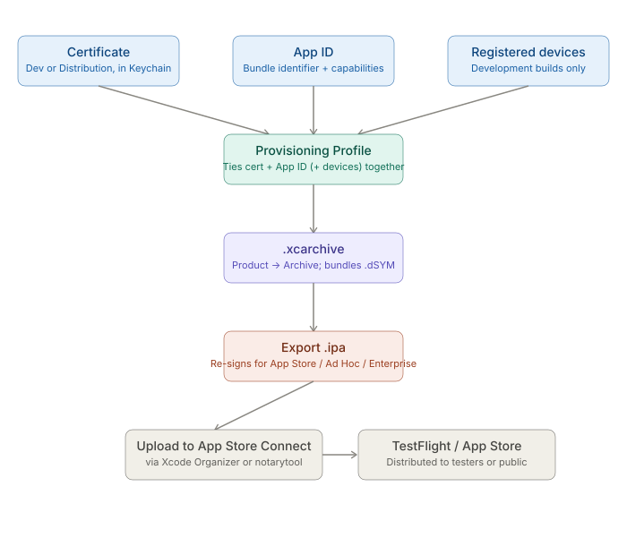

# React Native CLI — Native Toolchains: iOS — Signing and Release Builds

_Last updated: 2026-08-12_

## Overview

Deep dive on iOS signing and the release pipeline end-to-end — from the three pieces of identity Apple requires through archiving, exporting, and reaching TestFlight/App Store — following up on the brief mention in [02. Xcode build specifics.md](02.%20Xcode%20build%20specifics.md).

## The three pieces of iOS signing

Unlike Android, where a single keystore file signs everything, iOS signing has three moving parts, all tied to an Apple Developer account:

- **Certificate** — proves *who* is building the app. Lives in the local Keychain, backed by a private key. Comes in two flavors: **Development** (running on your own devices) and **Distribution** (TestFlight/App Store).
- **App ID** — identifies *what* app this is (the bundle identifier, e.g. `com.yourcompany.app`), plus which capabilities it's allowed to use (push notifications, App Groups, etc.).
- **Provisioning Profile** — the glue: *this certificate* + *this App ID* + (for development) *these specific devices* are allowed to run *this app*, and it expires on a specific date.

If any one of these drifts out of sync — an expired cert, an App ID capability missing from the profile, an unregistered device — the build fails signing, often with a cryptic Xcode error.

## Automatic vs manual signing

**Automatic signing** (Xcode's default, and what most RN projects use):
- Xcode manages certs and provisioning profiles for you, creating/renewing them via your Apple ID's connection to the Developer Portal.
- Set per target: Signing & Capabilities → check "Automatically manage signing," pick your Team.
- Good for solo devs and day-to-day work; Xcode silently fixes profile drift when it can.

**Manual signing**:
- You explicitly pick the certificate and provisioning profile per build configuration.
- Needed for CI/CD (Fastlane, GitHub Actions, Bitrise) where there's no interactive Xcode session to auto-fix things, and for teams that want profiles centrally managed and version-controlled — typically via `fastlane match`, which encrypts and shares certs/profiles across a team through a git repo.
- The iOS analog to Android committing a release keystore somewhere secure — except here it's certs + profiles instead of one keystore file.

## Archiving and exporting

The release pipeline has two distinct steps, unlike Android's single `assembleRelease`:

1. **Archive** (`.xcarchive`) — Xcode compiles a release build and packages it with full debug symbols (`.dSYM`) into an archive. Done via Product → Archive, or `xcodebuild archive` on CI.
2. **Export** — from the archive, export an `.ipa` for a specific destination: App Store Connect (TestFlight/App Store), Ad Hoc (specific registered devices), or Enterprise. Each export method re-signs with the matching provisioning profile for that destination.

The `.dSYM` bundled in the archive is what lets you later symbolicate a crash report (turn memory addresses back into function names/line numbers) — Xcode Organizer or `xcrun` can do this against archives you've kept around.

## Common signing failures

- **Expired certificate or provisioning profile** — profiles expire yearly; certs too. The classic "fine yesterday, broken today" bug.
- **Mismatched provisioning profile** — profile doesn't include the device being tested on (dev builds), or predates a new App ID capability (e.g. adding Push Notifications), so it's now stale.
- **Missing entitlements** — the entitlements file (capabilities like Push, App Groups, Associated Domains) doesn't match what's declared on the Developer Portal for that App ID.
- **Team/account mismatch** — especially after transferring a project between Apple Developer accounts or teams; automatic signing can get confused about which team owns which profile.

## Compared to Android

| | Android | iOS |
|---|---|---|
| Signing artifact | Local keystore file (`.jks`/`.keystore`) | Certificate + App ID + Provisioning Profile, tied to Apple Developer account |
| Where state lives | On disk, wherever the keystore is put | Apple's servers (Developer Portal) + local Keychain |
| Team sharing | Share the keystore file + password securely | `fastlane match` (shared encrypted repo) or manual portal access per teammate |
| Expiration | Keystores don't expire (typically 25+ year validity) | Certs and profiles expire ~1 year — recurring renewal burden |
| Output format | `.apk`/`.aab` | `.ipa` (via archive → export) |

The big mental-model shift: Android's signing state is a **file you control**; iOS's is **portal-side state you sync into local certs/profiles** — which is why CI setups for iOS are more involved (`fastlane match` or manual profile management) than Android's "just protect the keystore file" story.

## Key Takeaways

- iOS signing splits identity across three parts — Certificate, App ID, Provisioning Profile — rather than Android's single keystore file.
- Automatic signing is fine for local dev; manual signing (often via `fastlane match`) is needed for CI and team-shared profile management.
- The release pipeline is archive-then-export (`.xcarchive` → `.ipa`), not a single build step — the archive also carries the `.dSYM` needed for later crash symbolication.
- Certs and provisioning profiles expire annually, unlike Android's effectively-permanent keystore — a recurring maintenance burden unique to iOS.

## Open Questions / Follow-ups

- `fastlane match` internals — how the encrypted cert/profile repo is structured and synced across a team.
- Entitlements/capabilities deep dive — how Developer Portal capabilities map to the entitlements file and `Info.plist`.
- How this signing flow plays out end-to-end in a CI pipeline (GitHub Actions/Bitrise) without an interactive Xcode session.
