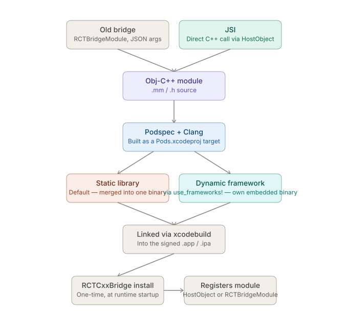

# React Native CLI — Native Toolchains: iOS — Native Module and JSI Build Path

_Last updated: 2026-08-12_

## Overview

Follows up on the open question in [01. Core pieces and how they fit together.md](01.%20Core%20pieces%20and%20how%20they%20fit%20together.md) about the native-module build path. Covers how a native module's Objective-C/Swift/C++ actually gets built via CocoaPods and Xcode, and — mirroring Android's [04. Native module and JSI build path.md](../Android/04.%20Native%20module%20and%20JSI%20build%20path.md) — clarifies that JSI changes the *runtime calling convention* into that native code, not the build system that produces it.

## Where the native code lives and how CocoaPods finds it

An iOS native module's source usually looks like:

```
ios/
  MyNativeModule.h
  MyNativeModule.mm     ← Objective-C++: can mix Obj-C and C++/JSI in one file
  MyNativeModule.podspec
```

or, for a Swift-based module:

```
ios/
  MyNativeModule.h        ← Obj-C bridging header for the app target
  MyNativeModule.swift
  MyNativeModule.podspec
```

The `.podspec` is the load-bearing piece — how a library declares itself to CocoaPods, and the rough iOS counterpart to a Gradle module's `build.gradle`:

```ruby
Pod::Spec.new do |s|
  s.source_files = "ios/**/*.{h,m,mm,swift}"
  s.dependency "React-Core"          # pulls in JSI/bridge headers
  s.pod_target_xcconfig = {
    "CLANG_CXX_LANGUAGE_STANDARD" => "c++17"
  }
end
```

When `pod install` runs, CocoaPods reads every dependency's podspec and turns each one into its own **target inside `Pods.xcodeproj`** — the same generated project described in the Core pieces doc. A native module isn't built by a separate toolchain the way Android's NDK is; it becomes just another target that `xcodebuild` compiles with ordinary Clang, as part of the workspace.

## Bridging headers vs. a pod's own header handling

Worth being precise here, since the terminology overlaps confusingly: the "bridging header" (`YourApp-Bridging-Header.h`) most people mean is specifically an **app-target** mechanism — how Swift code in the *app* sees Objective-C symbols in the *app*. It's set once in Build Settings and only applies within that one target.

A **pod** that mixes Swift and Objective-C doesn't use that mechanism at all:
- Swift auto-generates a `-Swift.h` header exposing its public symbols to Objective-C consumers.
- Objective-C symbols are exposed back to Swift via the pod's umbrella header (or `s.public_header_files` in the podspec).

## Static libraries vs. dynamic frameworks — why `use_frameworks!` exists



By default, CocoaPods builds every pod as a **static library** and links all of them into one final app binary. This is a real structural difference from Android, where each native module's `.so` is a separate shared object per ABI (see Android's "per-ABI compilation" section) — on iOS, everything gets flattened into a single binary at link time by default.

That flattening is exactly why Swift-containing pods are finicky: Swift's module system doesn't play cleanly with plain static libraries. The common fix is `use_frameworks!` in the `Podfile`, which switches every pod to build as a **dynamic framework** — a separate embedded binary — instead of a static lib merged into one blob.

## JSI's role — and what it doesn't change

Same core lesson as the Android doc, different mechanics: **JSI doesn't change how the code gets built.** The `.mm`/`.cpp` files compile through the exact same Clang/Xcode pipeline above, whether the pod ends up as a static lib or a framework. What JSI changes is what happens *after* the binary loads:

- **Old bridge** — a native module subclasses `RCTBridgeModule`, exposes methods via `RCT_EXPORT_METHOD`, and JS calls cross an async, JSON-serializing bridge queue.
- **JSI** — the module installs a C++ `HostObject`/`HostFunction` directly into the JS runtime (Hermes), usually via an install function called once from `RCTCxxBridge` at startup. From then on, a JS call into native is a direct C++ call — no JSON, no queue.

The `.mm` (Objective-C++) file extension is what makes this possible: it lets a single file mix Objective-C (for `RCTBridgeModule` conformance) and C++ (for touching JSI's `Runtime`/`HostObject` types) in one translation unit, without a JNI-style marshaling layer.

## Where this breaks in practice

Failure signatures distinct from Android's:

- **`Undefined symbols for architecture arm64`** — a linker error; the iOS equivalent of Android's `UnsatisfiedLinkError`, but caught at build time (static linking) rather than runtime (`dlopen`).
- **`duplicate symbol` / "Multiple commands produce…"** — two static-lib pods define the same symbol and collide when merged into one binary. No real Android equivalent — Android's per-ABI `.so` files are isolated from each other, but iOS's static-lib-into-one-binary model means naming collisions between unrelated pods are possible.
- **`Module 'X' not found` / "no such module"** — a Swift pod was built without `use_frameworks!` (or `:modular_headers => true` for its Obj-C dependencies), so the generated module map isn't there.
- **`Use of undeclared type` referencing `-Swift.h`** — the Swift-generated header wasn't found, usually a stale derived-data or podspec header-visibility issue.

## Key Takeaways

- Native modules compile through the same CocoaPods → `Pods.xcodeproj` target → Clang pipeline as any other dependency — there's no separate native-module-specific toolchain like Android's NDK/CMake.
- The app-target "bridging header" and a pod's own Swift/Obj-C interop are different mechanisms — don't conflate them.
- CocoaPods defaults to static libraries merged into one app binary; `use_frameworks!` switches to dynamic frameworks, mainly needed for Swift-heavy pods. This static-vs-dynamic choice is the iOS structural analogue of Android's per-ABI `.so` multiplication, but it's a build-time linking decision, not a runtime architecture split.
- JSI is a calling-convention change (direct C++ call vs. bridge + JSON), not a build-system change — identical reasoning to Android, just without a JNI-style marshaling layer since Objective-C++ can mix languages in one file.
- Linker-time duplicate symbols and missing module maps are the characteristic iOS failure modes here, distinct from Android's runtime `dlopen` failures.

## Open Questions / Follow-ups

- Walk through an actual mixed Swift/Objective-C podspec in detail.
- The `RCTCxxBridge` install call in detail — what the C++ registration function actually looks like on iOS.
- Step-by-step debugging process for a duplicate-symbol linker error.
