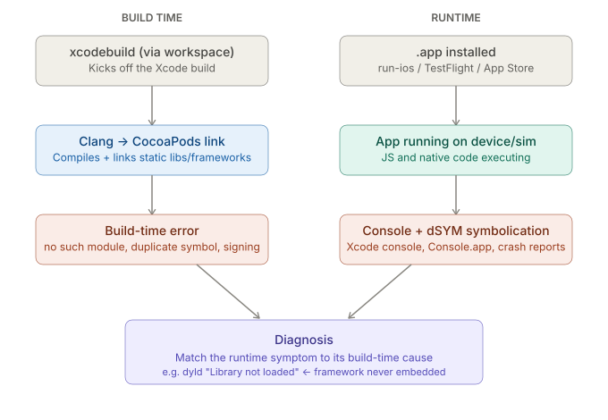

# React Native CLI — Native Toolchains: iOS — Debugging Tools

_Last updated: 2026-08-12_

## Overview

Covers the iOS-specific toolkit for diagnosing failures beneath the JS layer — where a build actually failed underneath RN CLI's truncated error output, and where runtime crashes surface once the app is running. Mirrors Android's [05. Debugging tools.md](../Android/05.%20Debugging%20tools.md), and follows up directly on the failure modes flagged in [04. Native module and JSI build path.md](04.%20Native%20module%20and%20JSI%20build%20path.md).

## Two failure domains: build-time vs runtime



Same split as Android — treating these as one search wastes time:

- **Build-time failures** — Xcode/Clang/CocoaPods never produced a working `.app`. Nothing runs.
- **Runtime failures** — the `.app` built fine, but crashes or misbehaves once installed and running.

## Build-time: getting past RN CLI's truncated errors

`npx react-native run-ios` wraps `xcodebuild`, and like the Android wrapper, often shows only a tail of the real output. Drop to raw `xcodebuild` for the full picture:

```bash
xcodebuild -workspace ios/MyApp.xcworkspace -scheme MyApp -configuration Debug build
```

Xcode's own **Report Navigator** (⌘9) shows the same build log but with clickable errors and a collapsible step tree — the same relationship Android Studio's Build tool window has to raw Gradle output. For CocoaPods-specific resolution failures (version conflicts, missing specs), `pod install --verbose` is the CocoaPods-side equivalent of Gradle's `-i`/`-d` flags.

## Runtime: where crashes and logs surface

- **Xcode's console** (bottom pane while running from Xcode) — `NSLog`/`os_log` output and uncaught Objective-C/Swift exceptions; the closest thing to Android's `AndroidRuntime` tag.
- **Console.app** — for viewing device logs *without* Xcode attached, e.g. debugging a TestFlight build a tester has open. Filter by process name to cut the OS-wide noise.
- **LLDB** — Xcode's built-in debugger; breakpoints pause Swift/Obj-C and, since native modules are often `.mm`, C++ frames too, in the same session.

For an actual native crash (e.g. `EXC_BAD_ACCESS`), what surfaces is a backtrace of raw memory addresses — meaningless until symbolicated.

## Symbolication: `.dSYM` is iOS's counterpart to Android's per-ABI `.so` + `ndk-stack`

Every build produces a `.dSYM` bundle holding debug symbols separately from the compiled binary. A crash backtrace is only readable once matched against the **exact** `.dSYM` for that exact build (same architecture, same version) — directly analogous to needing the matching-ABI `.so` for an Android tombstone.

This matters most for **TestFlight/App Store crashes**: Xcode's **Organizer** window pulls crash reports Apple collected from real users and auto-symbolicates them, but only if the matching `.dSYM` was uploaded at archive time (or is found locally). A common gotcha: losing track of dSYMs means a pile of crash reports that can never be read.

**Instruments** (Xcode's profiler suite) is the rough iOS counterpart to Android's profiler tooling for memory/performance — worth knowing it exists, though a real walkthrough is its own topic.

## Connecting the two: a dyld "Library not loaded" crash

Ties directly back to the `use_frameworks!` static-lib-vs-framework choice from the native-module doc. Walking the failure the same way the Android doc walks `UnsatisfiedLinkError`:

1. App launches, immediately crashes. Xcode console / Console.app shows: `dyld: Library not loaded: @rpath/SomePod.framework/SomePod, Reason: image not found`.
2. This is a **runtime** symptom — the linker was happy at build time (the framework's stub was there to link against), so no build error occurred.
3. The **build-time** root cause: when `use_frameworks!` is set, CocoaPods adds a `[CP] Embed Pods Frameworks` build phase that copies each framework's actual binary into the app bundle. If that phase is missing or misconfigured (common after manual Xcode project surgery), the app links fine but the framework binary is never physically present at launch.

The general pattern: **the runtime tool tells you *what* broke; the build configuration tells you *why* it was never going to work.**

## Key Takeaways

- iOS debugging splits into build-time (Xcode/Clang/CocoaPods never produced a `.app`) and runtime (the `.app` crashes once running) — same domain split as Android.
- RN CLI's own error output is frequently truncated; raw `xcodebuild` and `pod install --verbose` are the escalation path to the real error.
- Xcode's console and Console.app are where native crashes and exceptions surface; Console.app specifically covers devices without Xcode attached.
- Native crash backtraces need symbolicating against the matching `.dSYM` — the runtime counterpart to per-ABI `.so` symbols on Android, and the reason lost dSYMs make TestFlight/App Store crash reports unreadable.
- Diagnosing runtime native errors (e.g. a dyld "Library not loaded" crash) means matching a runtime symptom to a build-time cause — here, a `use_frameworks!` framework that was linked but never embedded.

## Open Questions / Follow-ups

- Symbolicating a real crash report step by step in Xcode's Organizer.
- Instruments walkthrough for memory/performance profiling.
- Flipper / React Native DevTools comparison — belongs to the broader "Debugging & Performance" roadmap topic, not this iOS-specific one.
