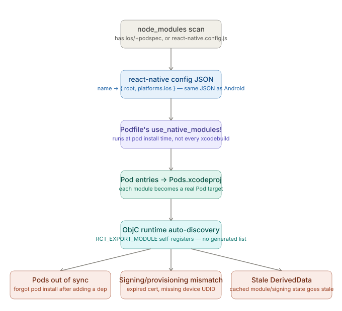

# React Native CLI — Native Toolchains: iOS — Where RN CLI Abstracts This Away

_Last updated: 2026-08-12_

## Overview

Covers what `npx react-native run-ios` actually does versus raw `xcodebuild`/`pod install`, how autolinking wires a native module into the build, and the three failure points flagged in [Topics.md](Topics.md) — Pods out of sync, signing/provisioning mismatches, and stale DerivedData. Mirrors Android's [06. Where RN CLI abstracts this away.md](../Android/06.%20Where%20RN%20CLI%20abstracts%20this%20away.md), and directly answers that doc's open question about the iOS-side autolinking equivalent.

## The `run-ios` wrapper layer

Two layers of abstraction, same shape as Android:

- **`react-native-cli` (JS layer)** — resolves the simulator/device target, checks whether Pods need reinstalling, then shells out to `xcodebuild`. This is the thin wrapper already covered in the [debugging tools doc](05.%20Debugging%20tools.md) — when its output is truncated, dropping to raw `xcodebuild`/`pod install --verbose` is the fix.
- **The Podfile's `use_native_modules!`** — this is where autolinking actually happens, at `pod install` time. This is the layer this doc digs into.

## How autolinking wires a native module in — and where it diverges from Android

Steps 1–2 are literally the same JSON `react-native config` produces for Android — the CLI scans `node_modules` for anything with an `ios/`+podspec, or a `react-native.config.js` entry. The structural fork happens at the next step:

- **Android** re-derives the dependency graph fresh at Gradle *configure* time — every single build.
- **iOS** resolves autolinking at **`pod install` time** — a distinct, explicit step, not something `xcodebuild` re-derives on its own. Add a new native-module package and forget to run `pod install` again, and Xcode's build simply won't know it exists.

## No generated registration list — the Objective-C runtime does it instead

Android's autolinking has to generate a `PackageList` wired into `MainApplication.getPackages()`, because Java/Kotlin has no built-in mechanism for React Native to discover native modules on its own.

iOS doesn't need that step. A native module marked with `RCT_EXPORT_MODULE()` self-registers via the **Objective-C runtime** — `RCTBridge` walks all loaded classes at launch and picks out anything conforming to `RCTBridgeModule`. Autolinking's entire job on iOS narrows to getting the module's compiled code *linked into the binary* (via the Pod target); once it's in the binary, discovery is automatic. There's no iOS equivalent of "forgot to register it" as a failure mode, because that step doesn't exist.

The same `react-native.config.js` escape hatch works here too — `platforms: { ios: null }` opts a package out, same file format as Android.

## Where it breaks

**Pods out of sync with `Podfile.lock`** — the direct consequence of autolinking resolving at `pod install` time rather than every build. Add/remove a native dependency and forget to reinstall, and the result is either a missing-module build error or CocoaPods' own guard: *"The sandbox is not in sync with the Podfile.lock."* RN CLI's wrapper often just reports "build failed" without surfacing that specific message.

**Signing/provisioning mismatches** — `run-ios` doesn't manage signing; it just invokes `xcodebuild` against whatever signing config the Xcode project already has. An expired certificate or a provisioning profile missing the test device's UDID surfaces as a build failure, but it's an Apple Developer account/portal problem, not a CocoaPods or autolinking one — easy to conflate with a Pods issue since the wrapper's output doesn't distinguish them.

**Stale DerivedData** — Xcode caches build products and module data aggressively in `~/Library/Developer/Xcode/DerivedData`. After version bumps or Pod changes, stale cache entries can cause confusing, non-reproducible build errors unrelated to the actual source changes. Fix: delete the project's DerivedData folder. A distinctly iOS/Xcode gotcha with no direct Android Gradle-cache equivalent called out this specifically.

All three surface as build-time failures, so the same escalation from the [debugging tools doc](05.%20Debugging%20tools.md) applies: raw `xcodebuild`/`pod install --verbose` names the real cause where RN CLI's wrapper just says "build failed."

## Key Takeaways

- `run-ios` is a thin JS wrapper around `xcodebuild`; autolinking is a separate abstraction that happens via the Podfile's `use_native_modules!` at `pod install` time.
- Unlike Android's every-build Gradle-configure resolution, iOS autolinking is resolved at the explicit `pod install` step — forgetting to rerun it after a dependency change is a distinctly iOS failure mode.
- iOS needs no generated registration list like Android's `PackageList` — `RCT_EXPORT_MODULE` classes self-register via Objective-C runtime introspection once their code is linked into the binary.
- The three characteristic iOS failure points are Pods/`Podfile.lock` desync, signing/provisioning mismatches (an Apple portal problem, not a CocoaPods one), and stale DerivedData caches.
- All three are build-time failures and follow the same raw-`xcodebuild`/`pod install --verbose` escalation path as any other iOS build failure.

## Open Questions / Follow-ups

- What `RCT_EXPORT_MODULE`'s runtime registration actually looks like under the hood (the Objective-C runtime mechanics).
- New Architecture codegen's effect on this pipeline (Fabric/TurboModules autolinking) — belongs to the broader "New Architecture Awareness" roadmap topic, not this file.
