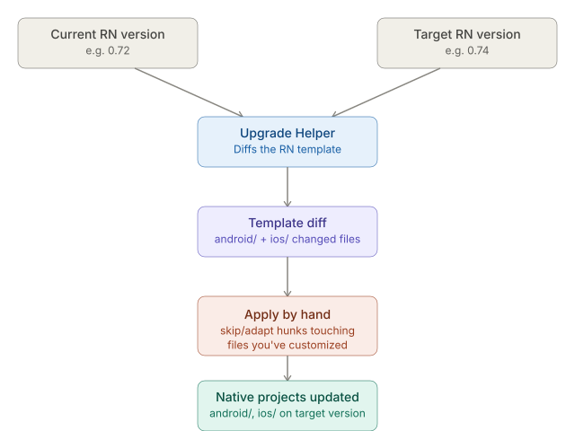
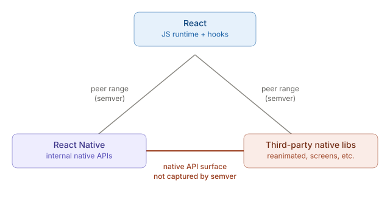

# React Native CLI — Dependency & Version Management

_Last updated: 2026-08-15_

## Overview

Unlike Expo's managed workflow, a CLI project has no layer smoothing over native version drift — upgrading RN, linking native modules, and installing dependencies all have manual, native-project-touching consequences. This covers the four recurring pain points: upgrading RN itself, autolinking troubleshooting, peer dependency conflicts, and knowing when a change needs a native rebuild step.

## Upgrading React Native itself

A plain `npm install react-native@latest` is **not** a full upgrade — it only bumps the JS dependency, leaving `android/` and `ios/` on the old generated template. Those folders have since been hand-edited (signing config, product flavors, custom native code), so nothing can blindly overwrite them.



**`npx react-native upgrade`** — the older built-in command, largely deprecated beyond trivial bumps; it tries to auto-apply changes and fails or conflicts silently on any customized file.

**RN Upgrade Helper** (`react-native-community.github.io/upgrade-helper`) — the current standard. Give it a "from" and "to" version and it shows a git-style diff of every template file that changed between them (`MainActivity.java`, `build.gradle`, `Podfile`, `Info.plist`, etc.). You then apply the relevant hunks to your own native files by hand — skipping or adapting hunks that touch files you've heavily customized, since the diff shows *intent*, not something you can blindly `git apply`.

Practical tip: bump one minor version at a time (0.72 → 0.73 → 0.74) rather than jumping several at once — smaller diffs, easier to isolate what broke.

## Autolinking — still needs troubleshooting

Autolinking (RN 0.60+) was meant to remove manual native linking entirely. At build time, RN CLI scans `node_modules` for packages declaring native modules and generates the linking glue:
- **Android** — writes an autolinking file consumed by Gradle to register packages in `MainApplication`.
- **iOS** — generates `Podfile` entries so CocoaPods pulls in each native module as a pod.

It mostly works, but still breaks in predictable ways:
- **Stale generated files** — a dependency is added/removed but the generated linking file doesn't regenerate. Fix: `cd android && ./gradlew clean`, or delete `ios/Pods` and re-run `pod install`.
- **Libraries that don't fully support autolinking** — older or poorly-maintained packages still need manual steps from their own README; don't assume `npm install` alone is enough.
- **Duplicate/conflicting native module names** — two packages registering the same module name causes a build-time collision autolinking can't resolve.
- **Needing to exclude a platform explicitly**, via `react-native.config.js`:
```js
module.exports = {
  dependencies: {
    'some-package': {
      platforms: { ios: null }, // don't autolink on iOS
    },
  },
};
```

Autolinking removed the *routine* manual work, but understanding the mechanism is still necessary to debug when it silently doesn't pick something up.

## Peer dependency conflicts



React and React Native are tightly version-coupled — bumping one without the other produces invariant violations or hook errors at runtime, not necessarily at install time. Third-party native libraries (reanimated, screens, gesture-handler, etc.) each declare peer ranges on RN, but those ranges are **JS-side semver** — they don't capture native API breakage. If a library hasn't caught up to a new RN release yet, its native Kotlin/Swift code can call an RN internal API that changed or was removed, causing a native build failure that no peer-dependency warning predicted.

Practical approach:
- Before bumping RN, check the Upgrade Helper and each major native library's changelog/issues for "supports RN X.Y" rather than trusting semver ranges alone for native-heavy packages.
- Clear `node_modules`, `Pods`, and Gradle caches after a dependency bump — stale artifacts often masquerade as real conflicts.
- `npx react-native doctor` (where available) surfaces environment/version mismatches early.

## Which changes need `pod install` / a Gradle sync

Not every `npm install` needs a native step:

| Change | iOS action | Android action |
|---|---|---|
| Pure-JS package | none | none |
| Package with native code (camera, storage, etc.) | `pod install` | Gradle auto-syncs on next build (autolinking regenerates) |
| Native code version bump of an existing dependency | `pod install` (sometimes `--repo-update`) | Gradle sync / clean build |
| Manually changed `Podfile`/`Podfile.lock` | `pod install` | n/a |
| Manually changed `android/build.gradle` or `app/build.gradle` | n/a | Gradle sync (Android Studio prompt, or `./gradlew clean`) |

Rule of thumb: if a package ships an `ios/`, `android/`, or a native `.podspec`/`.gradle` file in its own repo, assume a native step is needed. Check `node_modules/<pkg>` — a `.podspec` means CocoaPods needs to know about it; an `android/build.gradle` inside the package means Gradle needs a sync.

## Key Takeaways

- Upgrading RN is a manual diff-and-apply process (via Upgrade Helper), not a package bump — because your native projects have already diverged from the template.
- Autolinking removed routine manual linking but still needs troubleshooting: stale generated files, unsupported libraries, name collisions, and per-platform exclusions.
- Peer dependency ranges are semver and JS-side only — they don't catch native API breakage between RN and third-party native libraries, which is the more dangerous failure mode.
- Whether a change needs `pod install` or a Gradle sync comes down to whether the package/change touches native code — pure-JS changes need neither.

## Open Questions / Follow-ups

- Walking through an actual Upgrade Helper diff end-to-end on a real version bump
- `react-native.config.js` options beyond platform exclusion
