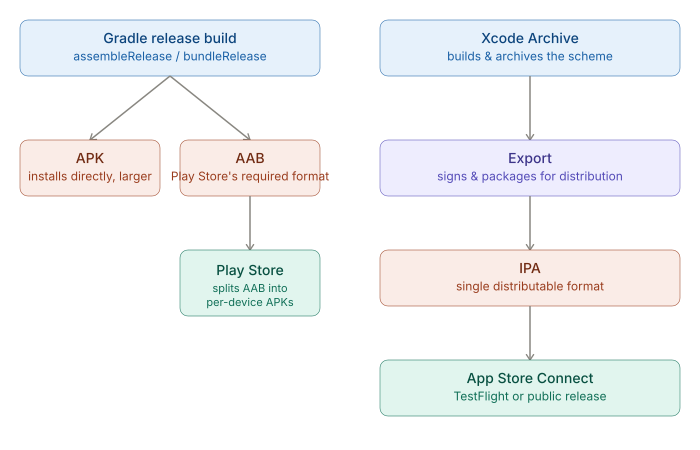
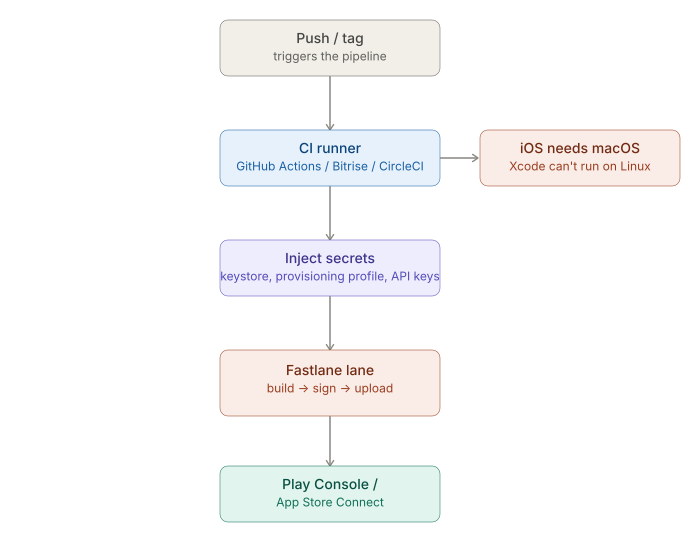

# React Native CLI — Build & Release Process

_Last updated: 2026-08-17_

## Overview

Once native toolchains and signing are in place, this covers the layer above them: how you go from source to a distributable artifact, repeatably, across environments. Four pieces — debug vs. release builds, the actual artifact formats, environment-specific configs, and CI/CD automation.

## Debug vs. release builds

The distinction isn't just "signed vs unsigned" — it changes what's actually running:

| | Debug build | Release build |
|---|---|---|
| JS source | Loaded from Metro over LAN | Bundled into the app package |
| Dev tools | Dev menu, Fast Refresh enabled | Stripped, no hot reload |
| Code size | No minification | Minified/obfuscated (Hermes bytecode, ProGuard/R8) |
| Signing | Debug cert (auto-generated) | Release cert (your keystore / provisioning profile) |
| Runtime | Larger binary, slower | Smaller, optimized for perf |

Android controls this via Gradle **build types** (`debug`/`release` in `android/app/build.gradle`); iOS via Xcode **build configurations** (`Debug`/`Release` schemes). Signing mechanics themselves are platform-specific and covered separately per-platform — what's new here is the *variant* concept layered on top: build type × environment (see below).

## Generating APK/AAB (Android) and IPA (iOS)

- **APK** (Android Package) — installable directly, historically the default. Contains compiled code + resources for *all* device configurations bundled together → larger download.
- **AAB** (Android App Bundle) — the format Google Play now requires for new apps. You upload the AAB; Play Store's servers generate optimized, device-specific APKs on demand (split by ABI, screen density, language). Smaller downloads for users, but an AAB isn't directly installable — testing one locally needs `bundletool`.
- **IPA** (iOS App Store Package) — the iOS equivalent: a zipped app bundle plus provisioning info. Always the single distributable format for iOS — no AAB-style server-side split.

## Environment-specific configs (dev/staging/prod)

Build type and *environment* are independent axes, easy to conflate — you can have a `debug` build pointed at the staging API, or a `release` build pointed at dev for QA.

Two common approaches:

- **`.env` files + `react-native-config`** — `.env.dev`, `.env.staging`, `.env.prod`, loaded at build time and exposed as native-readable constants (`BuildConfig` on Android, `Info.plist`/preprocessor macros on iOS). Simple, cross-platform, but doesn't create separate installable apps unless wired up separately.
- **Native flavors/schemes** — Android **product flavors** (`dev`, `staging`, `prod` in `build.gradle`, combined with build type → `devDebug`, `prodRelease`, etc.) and iOS **schemes + xcconfig files**. Each can get its own bundle ID, app icon, and display name, so dev/staging/prod can be installed side-by-side on the same device. More setup, but more robust for teams that need all three installed at once.

## CI/CD pipelines

The tooling splits into two layers:

- **Fastlane** — the automation layer that wraps the actual build/sign/upload commands (`gradlew`, `xcodebuild`, App Store Connect API, Play Console API) into reusable "lanes." Runs the same whether triggered locally or in CI.
- **CI runners** (GitHub Actions, Bitrise, CircleCI) — the *trigger and environment* layer: they check out code on a schedule/push/PR, provision a runner, inject secrets (signing certs, API keys) securely, and invoke Fastlane lanes.

Main gotcha: **iOS CI needs a macOS runner** — Xcode won't run on Linux — which is usually the cost/speed bottleneck compared to Android CI.

## Key Takeaways

- Build type (debug/release) and environment (dev/staging/prod) are separate axes — a release build can point at staging, and vice versa.
- AAB is now Play Store's required upload format; APK still exists for direct installs but isn't what you ship to the store. iOS has only one distributable format, the IPA.
- `.env` + `react-native-config` is the lightweight way to vary environment config; native flavors/schemes are the heavier option when you need separately installable dev/staging/prod builds.
- CI/CD for mobile is two layers: Fastlane automates the build/sign/upload steps, and a CI runner (GitHub Actions/Bitrise/CircleCI) provides the trigger and environment — with iOS specifically requiring a macOS runner.

## Open Questions / Follow-ups

- Setting up `react-native-config` end-to-end in a real project
- Writing an actual Fastlane lane for one platform and walking through the Fastfile
