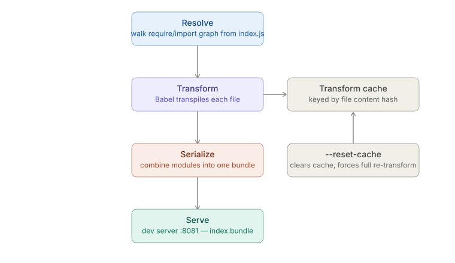

# Debugging & Performance — Metro Bundler Internals and Cache Clearing

_Last updated: 2026-08-18_

## Overview

Metro is React Native's JS bundler — RN's equivalent of Webpack, but purpose-built and run as a long-lived dev server rather than a one-shot build step. This doc covers what Metro actually does, where it caches work, and why that cache is often the real cause behind confusing "stale" bugs.

## What Metro is

Metro takes the JS/TS source graph starting at `index.js`, resolves every `import`/`require`, transforms each file with Babel, and serves up a bundle the native app can execute. It runs as a dev server (`react-native start`, port 8081 by default) that stays alive across requests — that persistence is exactly why caching matters here in a way it wouldn't for a one-shot compiler.

## The pipeline



1. **Resolve** — starting at the entry file, Metro walks every `require`/`import` and builds a dependency graph. This is where `.ios.js`/`.android.js` platform-specific extensions and `package.json` `"main"` fields get resolved.
2. **Transform** — each file is run through Babel (RN's preset handles JSX, TS, Flow, etc.) and turned into a wrapped CommonJS-style module. This is the expensive step, and it's cached per file.
3. **Serialize** — transformed modules are concatenated into a single bundle (or packaged differently for RAM bundles / Hermes bytecode).
4. **Serve** — the dev server exposes `http://localhost:8081/index.bundle?platform=ios&dev=true`, which the app requests on launch, and which Fast Refresh re-requests on JS-only changes.

## Where the cache lives, and when it lies to you

Metro caches transform (Babel) output keyed by file content hash + transform options, so unchanged files aren't re-transpiled on every request. The cache lives on disk under the OS temp dir (e.g. `$TMPDIR/metro-cache-*`), not inside the project folder — which is why it survives `npm install`s and branch switches.

That persistence is also the source of the classic symptom: you change `babel.config.js`, add a new asset extension, or switch branches with different dependency versions, and Metro serves stale transformed output because it didn't detect the change as cache-invalidating.

```bash
npx react-native start --reset-cache
```

This clears Metro's transform cache and forces a full re-transform on the next bundle request. It does **not** touch `node_modules`, the Gradle cache, or CocoaPods — it's purely the JS transform layer.

## Key Takeaways

- Metro's pipeline is Resolve → Transform → Serialize → Serve, run continuously by a dev server rather than as a one-shot build.
- The transform (Babel) output is cached per file by content hash, on disk, outside the project folder.
- `--reset-cache` only clears Metro's own transform cache — it's not a general "clean everything" command for native build caches.
