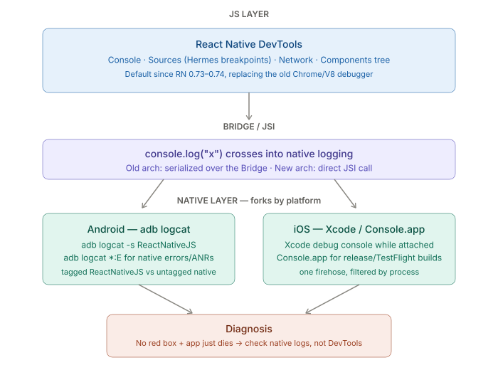

# Debugging & Performance — Flipper, React Native DevTools, and Native Logs

_Last updated: 2026-08-18_

## Overview

Debugging an RN CLI app splits into two separate worlds: JS-side tooling (React Native DevTools, and formerly Flipper) versus native-side log tooling (`adb logcat` on Android, Xcode console / Console.app on iOS). Knowing which world a symptom belongs to — and that a crash can happen below the JS runtime where JS tooling sees nothing — is the actual skill here.

## Where JS-side and native-side debugging split



If a problem never leaves JS-land (a bad render, a thrown JS error, a broken `fetch` call), it shows up as a red-box overlay, in the Metro terminal, and in React Native DevTools. If the crash is *below* the JS runtime — a native module segfault, an unhandled Obj-C exception, an ANR — JS tooling shows nothing, because the JS thread may already be dead or the crash never touched it. That's when `adb logcat` or Xcode's console are the only place the failure surfaces.

## React Native DevTools (the current default)

Replaced the old in-browser "Debugger" that ran JS in a Chrome tab via V8 — that setup was notoriously *not* representative of on-device Hermes behavior. Since **RN 0.73–0.74**, React Native DevTools is built on the Hermes debugger via the Chrome DevTools Protocol, so debugging now runs against the actual engine that ships on device.

Opened via `j` in the Metro terminal, or the dev menu → "Open DevTools". It provides:

- **Console** — `console.log`s, warnings, errors, with stack traces mapped through source maps
- **Sources** — breakpoints and step-through debugging against Hermes bytecode
- **Network** — inspect `fetch`/XHR calls, headers, payloads
- **Components** — a React DevTools–style tree with live props/state inspection

## Flipper — what it was, and what changed

Flipper was Meta's cross-platform desktop debugging app for RN roughly 0.62–0.73. It ran plugins beyond just JS: native layout inspector, crash reporter, shared-preferences/database viewers, network inspector — all in one desktop shell, talking to the app via a native SDK baked into the iOS/Android build.

As of **RN 0.74+, Flipper is no longer wired up by default in the template** — the CLI stopped auto-configuring it because React Native DevTools now covers most of what people used Flipper for day-to-day (network + console + component tree). Flipper still exists and can be wired back in manually via `react-native-flipper` for its native-side-only plugins (native layout inspection, database viewer), but a fresh CLI project today won't have it unless it's added.

**Practical takeaway:** on RN 0.74+, don't expect Flipper setup to "just be there" — it isn't anymore. React Native DevTools is the default.

## Native logs — where the platforms diverge

**Android — `adb logcat`**

- `console.log` calls are forwarded to native and show up tagged `ReactNativeJS`:
  ```
  adb logcat -s ReactNativeJS
  ```
- Native crashes/exceptions (Java/Kotlin) and ANRs show up untagged, mixed into the full stream — filter by error level or package:
  ```
  adb logcat *:E
  adb logcat | grep <your.package.name>
  ```
- This is the only place a native module exception shows up before it ever reaches JS.

**iOS — Xcode console / Console.app**

- Running via Xcode (`Cmd+R` or a debug build): native `NSLog`/crash output and bridged JS `console.log` both land in Xcode's debug console pane in real time.
- Running a release/TestFlight build with Xcode not attached: use **Console.app** on the Mac, connect the device, and filter by process name — this is how native crashes on a build not launched from Xcode get caught.
- No tag-based split like Android — it's one firehose filtered by process/subsystem.

**Cross-platform shortcut:** `npx react-native log-android` and `npx react-native log-ios` wrap the above (`adb logcat` / an `xcrun simctl`-based tail) to tail logs during a debug session without opening the full native tool.

## Key mental model

| Symptom | Tool |
|---|---|
| Red box, JS error, bad render | React Native DevTools / Metro terminal |
| API call returning wrong data | DevTools Network tab |
| App silently crashes, no red box | `adb logcat` / Xcode console — the crash is native |
| Native module throws before reaching JS | `adb logcat` / Xcode console |
| Need native-side layout/DB inspection | Flipper (manual setup, RN 0.74+) |

## Key Takeaways

- React Native DevTools (RN 0.73–0.74+) replaced both the old Chrome/V8 debugger and most of Flipper's day-to-day role — it debugs the real on-device Hermes engine, not a proxy.
- Flipper isn't gone, but it's no longer wired up by default; it only matters now for native-side-only plugins via manual `react-native-flipper` setup.
- Native crashes (segfaults, unhandled native exceptions, ANRs) happen below the JS runtime and never appear in DevTools or the Metro terminal — `adb logcat` (Android) and Xcode console / Console.app (iOS) are the only place they surface.
- `console.log` output is forwarded across the Bridge (old architecture) or via a direct JSI call (new architecture) into native logging, appearing under the `ReactNativeJS` tag on Android.
