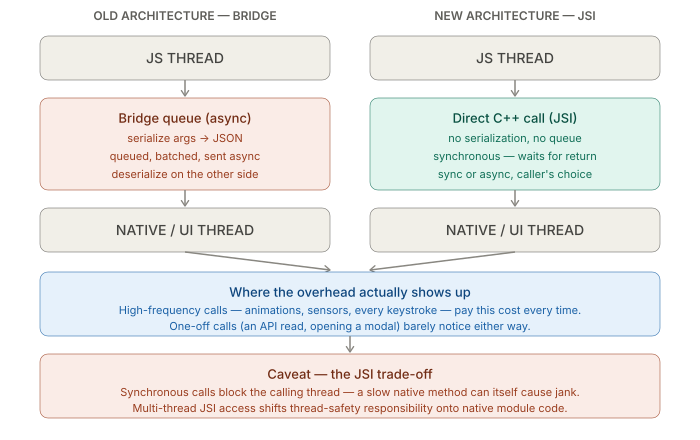

# Debugging & Performance — Bridge vs JSI Performance

_Last updated: 2026-08-18_

## Overview

Bridge vs JSI is about where the overhead in cross-language (JS ↔ native) calls actually comes from, and why it matters a lot for some calls and not at all for most others. The New Architecture (JSI, TurboModules, Fabric) removes the old bridge's serialization/queue overhead, but it's a trade-off, not a universal speed-up.

## The old world: the Bridge

Before the New Architecture, all JS ↔ native communication went through a single mechanism called the Bridge. Every call across the boundary — a native module method, a layout update, an event coming back from a native view — got:

1. Serialized into a JSON message
2. Pushed onto a queue, batched with other pending messages
3. Sent **asynchronously** across the bridge
4. Deserialized on the other side

That's fine for occasional calls (reading `AsyncStorage`, opening a camera, a one-off native API). It becomes a real cost when something calls across that boundary *every frame* — a gesture-driven animation reading scroll position 60 times a second, or a sensor streaming accelerometer data. Each round trip pays the JSON serialize/deserialize tax plus queuing latency, and it's fundamentally async — there's no way to get a synchronous answer back from native.

## JSI: the New Architecture's answer

JSI (JavaScript Interface) throws out the message-queue model entirely. JS holds a direct reference to a native "host object" (effectively a C++ pointer), and calling a method on it is a **direct, synchronous C++ function call** — no JSON, no queue, no forced async hop (though async is still available when wanted).

Two things get built on top of JSI:

- **TurboModules** — replacement for the old `NativeModules`, lazily loaded and called through JSI instead of the bridge
- **Fabric** — the new renderer, replacing the bridge-based `UIManager` for committing layout/view updates, also JSI-based

## Where this actually matters in practice

"JSI is faster" oversells it for most code — the overhead it removes was already invisible for low-frequency calls:

- **Doesn't matter much:** a one-time API call, reading app config on startup, opening a modal. The old bridge's async/serialization overhead on a single call is microseconds — invisible next to network latency or a re-render.
- **Matters a lot:** anything calling across the JS/native boundary at high frequency — gesture-driven UI, animations tracking a scroll or pan value, sensor data (gyroscope/accelerometer), or a native module hit on every keystroke. Serialization overhead multiplied by call frequency is what causes dropped frames.

The clearest real-world example is **Reanimated**: it uses JSI to run "worklets" (small JS functions) directly on the UI thread in C++, so a gesture-driven animation never has to round-trip back to the JS thread each frame — versus the old model, where every frame update had to cross the bridge.

## Caveat: JSI is a trade-off, not a free win

- A synchronous call **blocks the calling thread** until native returns — a slow native method called synchronously can itself cause jank in a way the old async bridge never could.
- JSI allows calling from multiple threads, which pushes more **thread-safety responsibility** onto native module authors that the bridge used to paper over by serializing everything through one queue.

## Key Takeaways

- The Bridge's cost was serialization (JSON) + queuing + forced async — real per-call overhead that only matters when a call happens at high frequency.
- JSI replaces that with a direct, synchronous C++ call — no serialization, no queue, and the caller chooses sync or async.
- TurboModules (native modules) and Fabric (the renderer) are both built on JSI.
- High-frequency call sites (animations, sensors, per-keystroke native calls) are where JSI's win is real; one-off calls barely notice the difference either way.
- The trade-off: synchronous calls can block a thread if the native method is slow, and JSI's multi-thread access model shifts thread-safety onto native module code.
