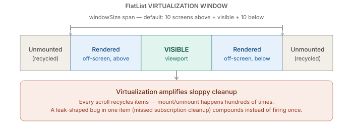

# Debugging & Performance — Memory Leaks and List Virtualization

_Last updated: 2026-08-18_

## Overview

RN memory leaks are almost always "something outlived the component that created it, because nothing told it to stop" — timers, listeners, or closures retained past unmount. `FlatList` virtualization mitigates memory usage for long lists, but it also amplifies any leak-shaped bug in a list item, since scrolling mounts and unmounts items hundreds of times per session.

## Where memory leaks actually come from

**Uncanceled timers**

```jsx
useEffect(() => {
  const id = setInterval(() => setCount(c => c + 1), 1000);
  return () => clearInterval(id); // miss this, and the closure over `setCount`
}, []);                            // (and everything it captured) lives forever
```

Without the cleanup function, the interval keeps firing after unmount, and every variable the closure captured — props, state, sometimes an entire parent object — stays reachable from the GC's perspective.

**Unremoved event listeners/subscriptions** — same shape, different API surface: `Dimensions.addEventListener`, `Keyboard.addListener`, `AppState.addEventListener`, `NativeEventEmitter` subscriptions (NetInfo, sensors, most native modules that push events). Each returns a subscription/handle that needs `.remove()` in the effect cleanup. Missed once in a rarely mounted component — barely noticeable. Missed in a list item or a frequently-mounted screen — compounds fast.

**Retained closures in navigation stacks** — React Navigation keeps backgrounded screens mounted in the stack by design, so back-navigation can preserve scroll position and state. A screen left three screens ago is often still alive, still holding whatever closures, timers, or large objects it captured, until it's actually popped off the stack. Passing large objects as navigation `params` extends this further: the whole stack holds a reference to that object for as long as the screen sits in history.

## Detecting leaks

- **iOS** — Xcode Instruments, the Leaks and Allocations templates, run against a device build.
- **Android** — Android Studio Profiler's memory view, or LeakCanary in a debug build for automatic leak detection with a stack trace pointing at the retaining reference.
- **JS heap** — a heap snapshot via React Native DevTools' Memory tab (Hermes-backed) — look for detached component instances or closures that shouldn't still exist after navigating away.

## List virtualization — why it matters here specifically



`FlatList` doesn't render every item in a long list; it renders a window around what's visible and recycles the rest. The tuning levers that matter:

| Prop | What it does | Trade-off |
|---|---|---|
| `windowSize` | How many "screens" worth of content stay mounted around the viewport (default: 21 — 10 above + visible + 10 below) | Lower = less memory, more risk of blank space on fast scroll |
| `removeClippedSubviews` | Unmounts native views once they're off-screen | Real memory win, mainly on Android — historically buggy on iOS in some RN versions, so test before relying on it |
| `getItemLayout` | Tells `FlatList` exact item height/offset up front, skipping a measurement pass | Needed for `scrollToIndex`; only works cleanly with fixed-height items |
| `keyExtractor` (stable keys) | Lets `FlatList` correctly diff/reuse items across data changes | Unstable keys (array index on a reorderable list) cause unnecessary remounts |
| `initialNumToRender` / `maxToRenderPerBatch` / `updateCellsBatchingPeriod` | Control how many items render per batch as the JS thread has idle time | Tuning knob between "blank space while scrolling fast" and "JS thread jank" |

## The connection: virtualization amplifies leaks

Virtualization mounts and unmounts list items constantly as the user scrolls. If a list item has a leak-shaped bug — a subscription without cleanup, a timer not cleared — a static screen might leak it once; a scrolling list leaks it hundreds of times per scroll session, because every recycled item is a fresh mount/unmount cycle. Virtualization amplifies sloppy cleanup instead of hiding it.

**FlashList** (from Shopify) is a drop-in `FlatList` replacement that recycles views more aggressively (closer to native `RecyclerView`/`UICollectionView` behavior) and tends to need less manual tuning of the props above — worth reaching for if long lists are a recurring pain point.

## Key Takeaways

- Most RN memory leaks reduce to a timer, listener, or subscription that outlived its component because a cleanup function was missing or incomplete.
- React Navigation's stack-preservation behavior (backgrounded screens stay mounted) extends how long a leaked closure or large `params` object stays alive.
- Detection tooling forks by platform: Xcode Instruments (iOS), Android Studio Profiler/LeakCanary (Android), React Native DevTools Memory tab for the JS heap.
- `FlatList` virtualization (`windowSize`, `removeClippedSubviews`, `getItemLayout`, stable `keyExtractor`) controls memory usage for long lists, but doesn't prevent leaks — it multiplies their effect, since scrolling mounts/unmounts items repeatedly.
- FlashList is a drop-in `FlatList` replacement with more aggressive view recycling, worth considering for lists that are a persistent perf/memory pain point.
