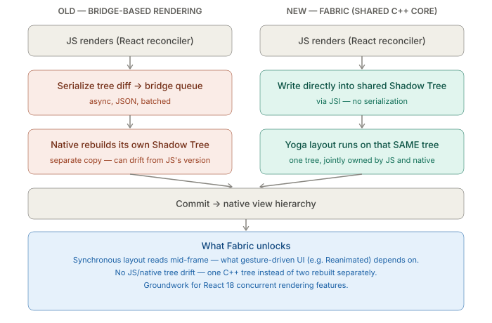
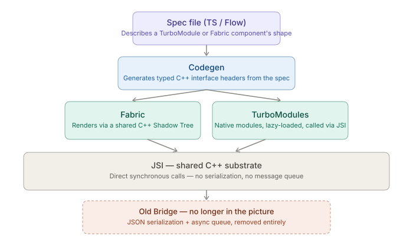

# New Architecture Awareness — Fabric, TurboModules, and Codegen

_Last updated: 2026-08-19_

## Overview

The New Architecture replaces the old Bridge with **JSI** as a shared C++ substrate, then builds two concrete systems on top of it: **Fabric** (the renderer) and **TurboModules** (native modules). **Codegen** is the tool that makes both of these type-safe by generating native-side contracts from a spec file you write in TypeScript or Flow. This doc covers what each piece actually does and how they compose — see [Bridge vs JSI performance](../05.%20Debugging%20%26%20Performance/03.%20Bridge%20vs%20JSI%20performance.md) for the call-path/performance angle on JSI itself.

## Why a New Architecture at all

The old Bridge architecture had three structural problems: every JS↔native call was async, batched, and JSON-serialized (bad for anything needing a same-frame answer, like a gesture-driven animation reading a native measurement); UI updates weren't prioritized, so a big JS computation could delay an in-flight animation frame; and native modules had no compile-time contract with JS, so type mismatches only surfaced at runtime. The New Architecture addresses all three by putting JSI underneath everything instead of the Bridge.

## Fabric — the new renderer



Fabric replaces the old UIManager/Shadow Thread setup. Instead of JS describing UI changes that get serialized and shipped over the bridge for native to rebuild as a separate tree, Fabric lets JS and native **share the same C++ core** for the Shadow Tree via JSI — there's one tree, jointly owned, instead of two independently-maintained copies that could drift out of sync.

Practical consequences:

- **Synchronous layout reads are possible** — a native view's layout can be measured in the same event-loop tick instead of waiting for a bridge round trip. This is what unlocks smooth gesture-driven UI in libraries like Reanimated 2/3.
- **Concurrent rendering support** — Fabric's Shadow Tree is designed to be interruptible/prioritized, laying groundwork for React 18 concurrent features (RN's use of this is still evolving).
- **Better consistency** — one C++ tree instead of JS's virtual description and native's separately-rebuilt copy potentially disagreeing.

A Fabric-enabled app has `newArchEnabled=true` in `gradle.properties` (Android) and the equivalent Podfile flag on iOS (`:fabric_enabled`, or on by default for RN 0.76+). Day to day, this is invisible unless a native library you depend on hasn't migrated yet — that's the actual maintenance pain point.

## TurboModules — the new native modules system

TurboModules replace the old `NativeModules` bridge modules, with two concrete improvements:

1. **Lazy loading, properly** — old native modules were all instantiated at app startup regardless of use. TurboModules load on first JS reference, cutting startup cost as an app accumulates native modules.
2. **Direct JSI calls, not bridge messages** — a TurboModule call goes straight through JSI as a real function call instead of a JSON-serialized bridge message.

```
Old NativeModules call:
  JS calls NativeModules.Foo.bar(x)
    → serialize args to JSON → bridge message queue
    → native deserializes, calls Foo.bar(x)
    → serialize return value → bridge back to JS

TurboModule call:
  JS calls TurboModuleRegistry.get('Foo').bar(x)
    → JSI host function call (synchronous C++ call, no serialization)
```

## Codegen — the glue that makes both type-safe

Fabric and TurboModules only work because there's a **compile-time contract** between the JS side and the native side. Codegen generates that contract from a spec file:

```ts
// NativeMyModule.ts
import type { TurboModule } from 'react-native';
import { TurboModuleRegistry } from 'react-native';

export interface Spec extends TurboModule {
  multiply(a: number, b: number): number;
}

export default TurboModuleRegistry.getEnforcing<Spec>('MyModule');
```

At build time, Codegen reads this spec and generates C++ interface headers that the native side (Java/Kotlin, Obj-C/Swift) must implement — argument types, return types, and nullability all locked in. A mismatch between JS and native used to be a silent runtime bug (native returns a string where JS expects a number, discovered from a crash or `undefined` deep in the UI); with Codegen, the native side won't compile if it doesn't match the spec. The same idea applies to Fabric native components — a spec for a component's props/events, with Codegen generating the platform glue.

## How the three fit together



JSI is the shared substrate underneath both Fabric and TurboModules. Codegen is the compile-time step that takes a spec file and generates the typed C++ contracts both systems rely on. The old Bridge isn't a fallback or a special case anymore — it's not in the picture at all.

## Where this actually bites you as a maintainer

- Third-party native libraries that haven't migrated to the New Architecture are the #1 source of "why won't this build" issues right now — check a library's New Architecture support before adopting it.
- Writing your own native modules means writing Codegen specs instead of hand-rolled bridge modules — a different authoring workflow, not just a performance flag.
- New Architecture is opt-out as of RN 0.76 (was opt-in before) — a project on an older RN version that hasn't touched this is likely still on the old Bridge.

## Key Takeaways

- JSI is the shared C++ substrate; Fabric (rendering) and TurboModules (native modules) are both built on top of it, and the old Bridge is gone entirely under the New Architecture.
- Fabric's core win is a single shared Shadow Tree instead of two independently-rebuilt copies — this is what enables synchronous, same-frame layout reads.
- TurboModules add lazy loading plus direct JSI calls in place of serialized bridge messages.
- Codegen is what makes the whole system type-safe: it generates C++ interface headers from a TS/Flow spec, so a JS/native shape mismatch is a compile error instead of a runtime surprise.
- The most common real-world friction is third-party native libraries that haven't migrated yet, not anything in an app's own JS code.

## Open Questions / Follow-ups

- Walking through migrating a real native module to a TurboModule spec end-to-end (writing the spec, implementing the generated interface on both platforms).
- How Fabric's synchronous layout access specifically changes what a gesture/animation library like Reanimated can do that it couldn't do on the old Bridge.
