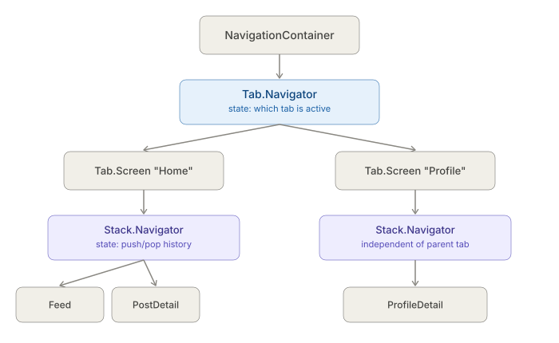
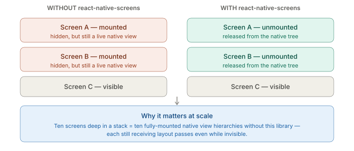

# React Native CLI — State, Navigation, Networking — React Navigation and its native dependencies

_Last updated: 2026-08-20_

## Overview

React Navigation's own logic is pure JS, but it depends on three libraries that aren't — `react-native-screens`, `react-native-gesture-handler`, and `react-native-reanimated` — each with its own native setup step and gotcha. This doc covers the navigation state model itself, then walks through each native dependency and what specifically can go wrong when it's skipped.

## The core model: a nav state tree, not routes-as-URLs



Unlike web routing, React Navigation's fundamental unit is a **navigation state tree** — a serializable JS object describing which screens are mounted and in what order, per navigator. Each navigator type (`Stack`, `Tab`, `Drawer`) is just a different UI/interaction pattern rendered from that same kind of state, and navigators **nest**, with each nested navigator owning its own slice of the tree.

This is why "go back" inside a tab doesn't reset the tab itself — each nested Stack keeps its own push/pop history independent of its parent Tab's state. It's also why deep linking into a specific screen (e.g. `myapp://profile/settings`) has to reconstruct the *entire* state tree top-down, not just jump to a leaf screen — the linking config maps a URL to a path through every nesting level.

## react-native-screens — why it's not optional in practice



Without it, every screen you've ever navigated to stays a live native view in memory — visually hidden, but still a fully-mounted `View`/`Fragment`/`UIViewController` still receiving layout passes. `enableScreens()` (called once, usually near the top of `index.js` or `App.tsx`) properly unmounts off-screen stack screens from the native view hierarchy.

Setup gotcha: it's autolinked for the JS↔native bridge, but since it registers new native view managers, a plain Metro/JS reload won't pick it up after install — a real native rebuild is required (`pod install` + rebuild on iOS, rebuild on Android) the first time.

## react-native-gesture-handler — the Android root-view step

iOS doesn't need special wiring because UIKit's gesture recognizer system is already the native layer — gesture-handler just registers into it directly. Android's default touch dispatch (View's `onTouchEvent`) predates gesture-handler's model, so on Android the root view must be swapped for gesture-handler's own:

```java
// MainActivity.java (or .kt)
import com.facebook.react.ReactActivity;
import com.facebook.react.ReactActivityDelegate;
import com.facebook.react.ReactRootView;
import com.swmansion.gesturehandler.react.RNGestureHandlerEnabledRootView;

public class MainActivity extends ReactActivity {
  @Override
  protected ReactActivityDelegate createReactActivityDelegate() {
    return new ReactActivityDelegate(this, getMainComponentName()) {
      @Override
      protected ReactRootView createRootView() {
        return new RNGestureHandlerEnabledRootView(MainActivity.this);
      }
    };
  }
}
```

Miss this step and the symptom is subtle: taps work fine, but swipe-to-go-back and Drawer swipe gestures either don't fire or feel laggy/conflict with `ScrollView`s — nothing crashes, so it's easy to chase the wrong cause. Newer gesture-handler versions have moved toward auto-wrapping via a JS-side `GestureHandlerRootView` instead of this native subclass — worth checking which approach the installed version's docs call for, since this has shifted across major versions.

## react-native-reanimated — the Babel plugin ordering gotcha

Reanimated compiles "worklets" — small JS functions annotated to run on the native/UI thread — via a Babel transform that **must run last**:

```js
// babel.config.js
module.exports = {
  presets: ['module:metro-react-native-babel-preset'],
  plugins: [
    // ...any other plugins first...
    'react-native-reanimated/plugin', // MUST be last
  ],
};
```

If another plugin runs after it and mutates the function bodies Reanimated already transformed, the failure looks nothing like a config problem — runtime errors deep inside a worklet, or silently-wrong animation values. Navigators use this for native-thread-driven screen transitions (so a transition keeps animating smoothly even if the JS thread is busy) — the same JSI-enables-native-thread-work mechanism covered in the New Architecture doc, applied here to gesture-driven transitions instead of rendering.

## Practical setup checklist for a CLI project

1. `npm install @react-navigation/native react-native-screens react-native-gesture-handler`
2. `cd ios && pod install` (iOS native rebuild required)
3. Android: rebuild (`npx react-native run-android`) so new native view managers register
4. Call `enableScreens()` early (usually top of `index.js` or `App.tsx`)
5. Android only: wrap the root view for gesture-handler (native subclass or `GestureHandlerRootView`, depending on version)
6. If using Reanimated: add its Babel plugin **last**, then fully restart Metro with `--reset-cache` (Babel config changes aren't picked up by a normal reload)

## Key Takeaways

- React Navigation's own state management is pure JS — a nested state tree, one slice per navigator — but its practical dependencies (`screens`, `gesture-handler`, `reanimated`) are not, and each needs a real native setup step beyond `npm install`.
- `react-native-screens` fixes a genuine memory/perf problem (native views staying mounted while hidden), not a cosmetic one.
- The Android gesture-handler root-view step is the single easiest-to-miss setup step in this whole area, because the failure mode is subtle (bad gestures) rather than a crash.
- Reanimated's Babel plugin must be last in the plugins array — order matters, and getting it wrong produces confusing worklet-level errors instead of a clear config error.

## Open Questions / Follow-ups

- How deep linking actually reconstructs the nested state tree from a URL.
- The `enableScreens()` lazy-loading option for very deep stacks.
