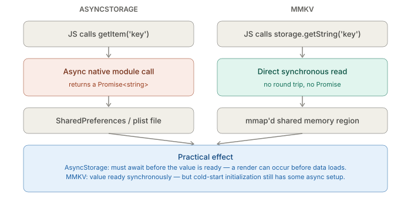
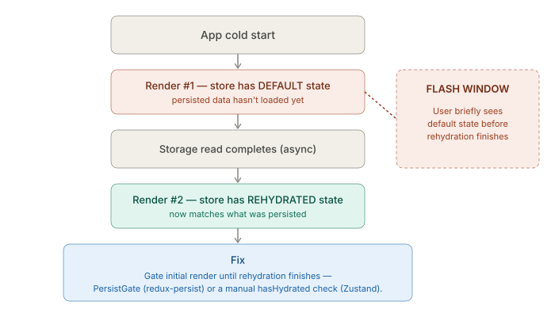

# React Native CLI — State, Navigation, Networking — State management and the persistence boundary

_Last updated: 2026-08-20_

## Overview

Context, Zustand, and Redux differ mainly in how re-renders propagate — a pure-JS/React concern with no native involvement. The native dependency only shows up once state needs to survive an app restart, at the persistence boundary: `AsyncStorage` vs `MMKV`, and the timing gotcha that comes with rehydrating persisted state on cold start.

## The three JS-level options — and why the choice barely touches native code

- **Context** — any consumer re-renders whenever the provided value changes, even if it only cares about one field of a larger object. Fine for low-frequency global state (theme, auth user); risky for anything that changes often, since it can cause wide re-render storms unless contexts are split carefully.
- **Zustand** — an external store outside React's tree; components subscribe via a selector (`useStore(s => s.count)`) and only re-render when that selected slice changes. This selector-based model is why Zustand tends to avoid the Context re-render problem without `useMemo`/`useCallback` gymnastics.
- **Redux** — the same selector-based subscription model as Zustand under the hood (`useSelector`), but adds a formal action/reducer pattern and a large middleware ecosystem (logging, undo/redo, RTK Query). The overhead is mostly conceptual/boilerplate, not runtime — pick it for the ecosystem or team-standardization, not for an inherent performance edge over Zustand.

None of this touches native code — that only enters once state needs to persist across restarts.

## The persistence boundary — this is where native gets involved



`AsyncStorage` is a native module: on Android it's backed by `SharedPreferences` (or a SQLite-backed implementation in newer versions), and on iOS by a native key-value file store. It only stores strings — every read/write of a JS object goes through `JSON.stringify`/`JSON.parse` before crossing into native.

`MMKV` (`react-native-mmkv`) is the faster alternative: backed by mmap'd shared memory, exposing **synchronous** reads/writes from JS instead of an async native-module round trip. This is the same "JSI lets a well-written native module expose synchronous access" mechanism from the New Architecture doc, applied to a key-value store instead of rendering or module calls.

## Wiring a store to persistence

**redux-persist** wraps the root reducer so specified slices are automatically written to storage on every state change, and rehydrated on startup:

```js
import { persistStore, persistReducer } from 'redux-persist';
import AsyncStorage from '@react-native-async-storage/async-storage';

const persistConfig = { key: 'root', storage: AsyncStorage, whitelist: ['auth', 'settings'] };
const persistedReducer = persistReducer(persistConfig, rootReducer);
const store = createStore(persistedReducer);
const persistor = persistStore(store);
```

**Zustand** doesn't need a separate library — persistence is a built-in middleware:

```js
import { create } from 'zustand';
import { persist, createJSONStorage } from 'zustand/middleware';

const useStore = create(
  persist(
    (set) => ({ count: 0, increment: () => set((s) => ({ count: s.count + 1 })) }),
    { name: 'app-storage', storage: createJSONStorage(() => AsyncStorage) }
  )
);
```

## The rehydration gotcha



Since the storage read is async (even MMKV has some async initialization on cold start, though its per-call reads are sync once ready), there's a real window where the app renders **before** persisted state has loaded — a flash of default/empty state, then a snap to the real persisted values once rehydration finishes.

`redux-persist`'s `PersistGate` component is the standard fix — it blocks rendering the app tree (showing a loading screen/splash instead) until rehydration completes. Zustand's `persist` middleware exposes a `hasHydrated` flag/callback checked manually to do the same thing — there's no built-in gate component, the loading guard has to be built by hand.

## Practical gotchas worth flagging

- **AsyncStorage isn't meant for large data.** There's no hard size limit enforced by the API, but performance degrades well before hitting any documented ceiling if large blobs (images-as-base64, big cached API responses) get stored instead of small config/auth data.
- **Migrating AsyncStorage → MMKV isn't a drop-in swap** — the storage adapter interfaces differ enough (sync vs async) that redux-persist/Zustand's storage adapter needs to match, and any hand-written direct `AsyncStorage.getItem` calls elsewhere in the codebase need updating too.
- **Don't persist volatile/large state** — persisting something like a full paginated list or live-updating data defeats the point of persistence while adding write overhead on every change; whitelist only what actually needs to survive a restart (auth tokens, user preferences, onboarding-seen flags).

## Key Takeaways

- Context vs Zustand vs Redux is a re-render-propagation choice, not a native-vs-JS one — native only enters at the persistence boundary.
- AsyncStorage is async and string-only; MMKV trades that for synchronous mmap'd reads — the same JSI-enables-sync-access idea as Fabric/TurboModules, applied to storage.
- Both redux-persist and Zustand's `persist` middleware automate writing to storage, but only redux-persist ships a ready-made `PersistGate`; Zustand's hydration guard has to be hand-built.
- The rehydration flash (default state briefly rendered before persisted state loads) is a real, easy-to-miss bug source on cold start — gate the initial render, don't just trust the store to "catch up."
- AsyncStorage → MMKV migration and large/volatile state persistence are the two most common ways this area causes real bugs.

## Open Questions / Follow-ups

- An actual AsyncStorage → MMKV migration walkthrough.
- How RTK Query's cache interacts with redux-persist — persisting it wholesale is a common footgun.
