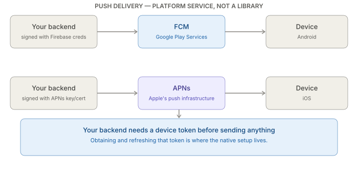
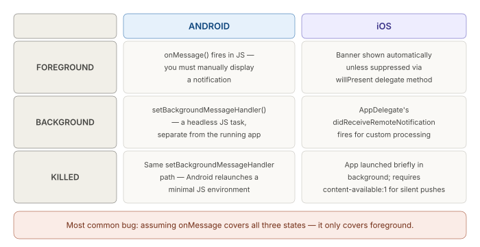

# React Native CLI — State, Navigation, Networking — Networking, offline handling, and push notifications

_Last updated: 2026-08-20_

## Overview

Plain networking and offline detection have little native involvement — the real depth in this topic is push notifications, which are a genuine platform service (FCM on Android, APNs on iOS) rather than something a library abstracts away. This doc covers offline handling briefly, then walks through the full push setup: platform registration, the library layer, and — the part that trips people up most — how a notification is handled differently depending on whether the app is foregrounded, backgrounded, or killed.

## Plain networking and offline detection

`fetch`/axios have zero native involvement — identical to any JS environment. Offline **detection** needs `@react-native-community/netinfo`, a native module wrapping `ConnectivityManager` (Android) / `NWPathMonitor` (iOS) and exposing the result as a JS event. Offline **handling** beyond detection — queuing mutations locally and replaying on reconnect — is a JS-level pattern; RTK Query and React Query both have built-in support for it (`onlineManager` in React Query, `setupListeners` + retry behavior in RTK Query), so it's rarely hand-rolled from scratch.

## Why push can't be "just a library"

A push notification's *delivery* only ever happens through the OS vendor's own infrastructure — Firebase Cloud Messaging (FCM) on Android, Apple Push Notification service (APNs) on iOS. No JS library replaces registering with these services directly. Your backend needs a device's **token** before it can send anything — obtaining that token, and keeping the app responsive to whatever arrives, is where the native setup lives.

## Android setup — FCM

1. **Create a Firebase project**, register the app's package name, download `google-services.json` into `android/app/`.
2. **Wire the Google Services Gradle plugin** — `classpath 'com.google.gms:google-services:...'` in the project-level `build.gradle`, `apply plugin: 'com.google.gms.google-services'` in the app-level one. This is what reads `google-services.json` at build time and generates the config Firebase's SDK needs.
3. **Runtime notification permission** — Android 13 (API 33)+ requires explicitly requesting `POST_NOTIFICATIONS` at runtime, same as camera/location permissions. Miss this and notifications silently don't show, with no crash and no obvious error — a common "works on my (older) test device but not on the tester's phone" bug.
4. **Notification channels** — required since Android 8 (API 26). Every notification must belong to a channel (its own importance level, sound, vibration settings); without one, the notification either doesn't show or falls back to a default channel the user could have muted.

## iOS setup — APNs

1. **Generate an APNs auth key (.p8)** in the Apple Developer portal — preferred over older per-app push certificates, since one key works across all apps and doesn't expire yearly like certificates do.
2. **Enable capabilities in Xcode**: Signing & Capabilities → **Push Notifications**, and for background/silent-push delivery, also **Background Modes → Remote notifications**. These write into the app's entitlements file — easy to miss since nothing in JS complains until a real device silently fails to receive anything.
3. **Register for remote notifications** — `UIApplication.shared.registerForRemoteNotifications()`, which triggers the device token callback the native/JS bridge layer picks up.
4. **If using Firebase as the cross-platform layer on iOS too** — `GoogleService-Info.plist` from the same Firebase project; Firebase can relay through APNs under the hood so the backend only talks to one API instead of two.

## The library layer

`@react-native-firebase/messaging` is the common cross-platform wrapper — handles token retrieval and foreground/background message events, paired with `@react-native-firebase/app` for the Firebase project wiring. `notifee` is often used alongside it specifically for **displaying** rich local notifications (custom layouts, actions, grouping), since Firebase's own display capabilities are fairly basic.

## Foreground vs. background vs. killed — where the real platform divergence is

The same "a push arrived" event is handled through three different code paths depending on app state, and those paths differ by platform. On Android, foreground delivery fires `onMessage()` in JS and requires manually displaying a notification (FCM doesn't auto-show one while the app is foregrounded); background and killed states both go through `setBackgroundMessageHandler()`, a headless JS task Android relaunches a minimal JS environment to run. On iOS, foreground delivery shows a system banner automatically unless suppressed via the `willPresent` delegate method; background delivery goes through `AppDelegate`'s `didReceiveRemoteNotification`; and killed-state delivery requires a `content-available: 1` flag in the payload for the OS to briefly launch the app for silent/data-only pushes at all.

**The single most common bug in this area**: assuming `onMessage` covers all cases. It only covers foreground — background and killed states require separate handlers.

## Token lifecycle gotcha

Tokens aren't permanent — they can rotate (app reinstall, OS-level token refresh, restoring from backup on a new device). Both FCM and APNs expose a token-refresh listener (`onTokenRefresh` in Firebase messaging) that must be wired to re-send the new token to the backend — an app that only sends the token once, at first launch, will silently stop receiving pushes for any user whose token later rotates.

## The CLI vs. Expo gap, restated concretely

Expo's managed workflow wraps all of this behind `expo-notifications` and their own push relay service (`expo-server-sdk` on the backend, sending to Expo's servers instead of FCM/APNs directly). On CLI, there's no such relay — the backend talks to FCM and APNs directly, using credentials generated by hand, which is exactly why every step above (Firebase project, APNs key, Xcode capabilities) is a manual one-time setup cost.

## Key Takeaways

- Push delivery is a real platform service (FCM/APNs), not something a JS library replaces — the backend needs its own Firebase credentials and its own APNs key/certificate.
- Android's runtime `POST_NOTIFICATIONS` permission (13+) and notification channels (8+), and iOS's Push Notifications + Background Modes Xcode capabilities, are all silent-failure points — nothing in JS errors when they're missing.
- Foreground, background, and killed app states are handled through genuinely different code paths on each platform — `onMessage` alone only covers foreground.
- Token rotation must be handled with a refresh listener, not just a one-time send at first launch.
- CLI requires direct FCM/APNs integration with hand-generated credentials; Expo's managed workflow hides all of this behind its own push relay.

## Open Questions / Follow-ups

- The actual `AndroidManifest.xml`/`Info.plist` entries involved in each setup step.
- How a headless JS background handler is registered and structured on Android.
