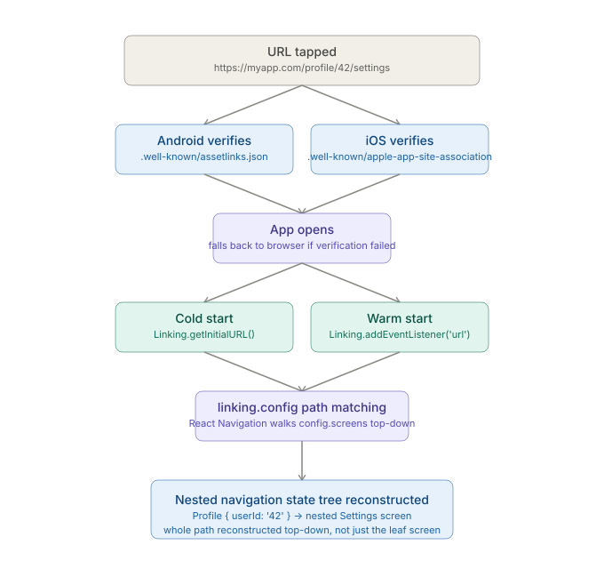

# React Native CLI — Platform-Specific Quirks — Deep linking and Universal Links

_Last updated: 2026-08-24_

## Overview

Deep linking is where platform divergence is most extreme: both platforms solve "open my app to a specific screen from a URL," but the ownership-verification mechanisms are completely different native configs, and reconstructing the right screen on the JS side is a separate problem from the native config entirely. This doc covers custom URL schemes vs. Universal Links/App Links, the native setup on each platform, and how React Navigation's `linking` config turns a URL into a full nested navigation state.

## Two categories of deep link

**Custom URL scheme** — `myapp://profile/42`. Simplest to set up, but any app can register the same scheme — there's no ownership verification, so a malicious app can claim `myapp://` too and either intercept links or spoof being your app. Fine for internal testing or low-stakes links, not for anything from an untrusted source (email, SMS, web pages).

**Universal Links (iOS) / App Links (Android)** — `https://myapp.com/profile/42`. Real `https://` URLs the OS verifies against a file hosted on your own domain, proving control of both the app and the domain. This is what matters in production — it also degrades gracefully (opens in browser) if the app isn't installed, unlike a custom scheme, which just fails silently.

## Android — intent filters + Digital Asset Links

```xml
<!-- AndroidManifest.xml -->
<activity android:name=".MainActivity">
  <intent-filter android:autoVerify="true">
    <action android:name="android.intent.action.VIEW" />
    <category android:name="android.intent.category.DEFAULT" />
    <category android:name="android.intent.category.BROWSABLE" />
    <data android:scheme="https" android:host="myapp.com" />
  </intent-filter>
</activity>
```
`android:autoVerify="true"` tells Android to check domain ownership at install time against:
```
https://myapp.com/.well-known/assetlinks.json
```
which contains the app's package name and signing certificate SHA-256 fingerprint. If verification fails (wrong fingerprint, file unreachable, wrong content-type), Android silently falls back to a disambiguation dialog ("Open with: Chrome / MyApp") instead of deep-linking straight into the app — a common silent failure when the release-signing fingerprint differs from what's registered, which happens easily if debug and release builds use different keys and only one fingerprint was added to `assetlinks.json`.

## iOS — Associated Domains + apple-app-site-association

```
<!-- entitlements, via Xcode capability -->
Associated Domains: applinks:myapp.com
```
Same idea, different file, no extension, must be served as `application/json` with **no redirects**:
```
https://myapp.com/.well-known/apple-app-site-association
```
containing the app ID (`TEAMID.bundleid`) and which paths are linkable. iOS fetches and caches this file at **app install time** — changing it later doesn't take effect until the app is reinstalled or the cache is manually invalidated, which makes debugging a changed AASA file confusing (the fix is live on the server, but an already-installed device doesn't know yet).

## The full resolution pipeline



Getting the OS to open the app is only half the problem — once inside, the JS layer has to turn a URL into the actual nested navigation state, the same top-down reconstruction covered in the [React Navigation doc](../07. State, Navigation, Networking/01. React Navigation and its native dependencies.md): a URL rebuilds an entire nested tree, not just a jump to a leaf screen.

```js
const linking = {
  prefixes: ['myapp://', 'https://myapp.com'],
  config: {
    screens: {
      Home: 'home',
      Profile: {
        path: 'profile/:userId',
        screens: {
          Settings: 'settings',
        },
      },
    },
  },
};

<NavigationContainer linking={linking}>
```
`myapp://profile/42/settings` reconstructs the whole path: a Profile screen (with `userId: '42'` as a param) containing a nested Settings screen — React Navigation walks `config.screens` top-down, matching path segments at each nesting level.

## Cold start vs. warm start

Two different APIs are needed depending on whether the app was already running:

```js
// Cold start — app launched BY the link
const url = await Linking.getInitialURL();

// Warm start — app already running, link opened while foregrounded/backgrounded
Linking.addEventListener('url', ({ url }) => { /* handle */ });
```
`linking.config` passed to `NavigationContainer` handles both cases automatically when wired up correctly, but any custom logic layered on top (e.g. an analytics hook before navigation) can miss the cold-start case — it only shows up when the app wasn't already running, which is easy to miss if testing only ever backgrounds and relaunches the app during development.

## Testing deep links locally

```bash
# Android
adb shell am start -W -a android.intent.action.VIEW -d "myapp://profile/42"

# iOS Simulator
xcrun simctl openurl booted "myapp://profile/42"
```
Neither command exercises the Universal Links/App Links **verification** step (the `.well-known` file check) — they simulate the URL being opened, enough to test `linking` config and navigation logic, but not enough to catch a misconfigured `assetlinks.json`/AASA file. That needs an actual tap from an external source (Notes app, Messages, email) on a real device.

## Key Takeaways

- Custom URL schemes have no ownership verification and can be claimed by any app; Universal Links/App Links verify domain ownership via a hosted `.well-known` file and degrade gracefully to the browser if the app isn't installed.
- Android checks `assetlinks.json` at install time against the signing certificate fingerprint — a mismatch (common with separate debug/release keys) silently falls back to a disambiguation dialog instead of failing loudly.
- iOS caches `apple-app-site-association` at install time — a changed file on the server doesn't take effect on an already-installed device until reinstall.
- Reconstructing a screen from a URL is a separate, JS-side problem from native verification — React Navigation's `linking.config` walks the nested screens config top-down to rebuild the full state tree, not just the leaf screen.
- Cold start (`Linking.getInitialURL`) and warm start (`Linking.addEventListener`) are different code paths; the cold-start case is the one most likely to get missed by custom logic since it only surfaces when the app wasn't already running.
- Local `adb`/`xcrun simctl` deep-link tests don't exercise the `.well-known` verification step — only a real external tap does.

## Open Questions / Follow-ups

- Structuring `linking.config` for very deep nesting.
- The `getStateFromPath`/`getPathFromState` override hooks for non-standard URL shapes.
